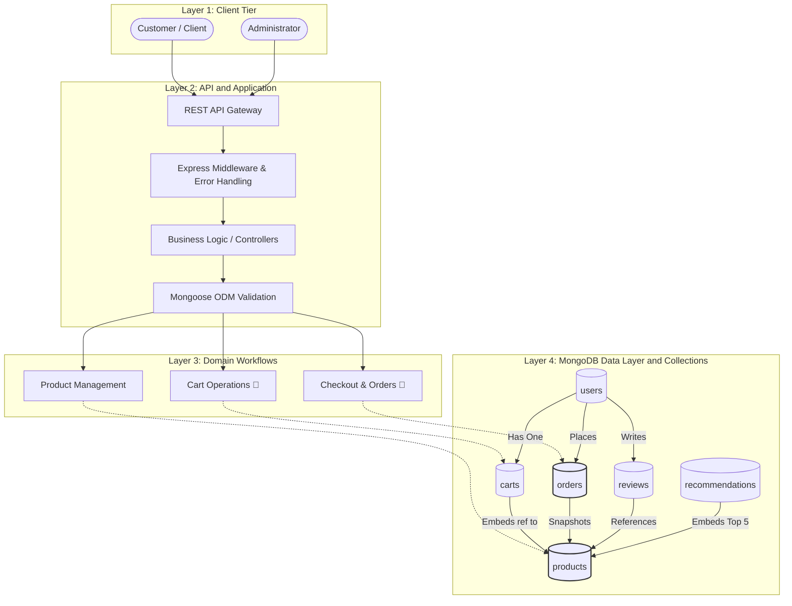

<div align="center">


**Intelligent NoSQL E-Commerce Platform**

UrbanKart is a comprehensive academic backend engineered to demonstrate advanced MongoDB/NoSQL data modeling, rigorous validation layers, deterministic seed workflows, and intelligent materialized recommendation views.


</div>

---

## 📖 2. Overview
UrbanKart is a modern e-commerce platform built as a comprehensive academic demonstration of NoSQL database principles. Unlike basic CRUD tutorials, UrbanKart is purposefully architected to conquer complex relational bottlenecks typically found in online retail. 

It heavily utilizes **MongoDB** as a flexible, document-oriented data store and **Mongoose** as the application-level ODM (Object Data Modeling) layer. The platform showcases how to correctly handle highly polymorphic product catalogs, volatile shopping carts, financially immutable order histories, and computationally heavy recommendation systems within a distributed NoSQL environment.

## ❓ 3. Problem Statement
Traditional relational databases (SQL) enforce rigid, tabular normalization. However, e-commerce data is inherently hierarchical, diverse, and fluid.
*   **Polymorphic Entities:** A laptop requires "RAM" and "Processor" specs, while a shirt requires "Size" and "Material". Modeling this in SQL requires either massive sparse tables (hundreds of empty columns) or the slow Entity-Attribute-Value (EAV) anti-pattern requiring multiple joins.
*   **Immutability:** When a user views an old receipt, the product name and price must exactly match the moment of purchase, regardless of subsequent database updates.
*   **Read vs. Write Optimization:** Carts experience high write-churn, while product catalogs require extreme read-optimization.
*   **Analytics Overhead:** Computing "related products" dynamically on every page load crushes database performance.

UrbanKart resolves these architectural challenges natively using MongoDB's document model, exploiting embedding, referencing, the Attribute Pattern, and the Snapshot Pattern.

## 🎯 4. Project Objectives

| Objective | What UrbanKart Demonstrates |
| :--- | :--- |
| **Document Data Modeling** | Eliminating ORM mapping overhead by aligning JSON objects directly with DB storage. |
| **Embedding vs Referencing** | Strategically denormalizing bounded data (cart items) and normalizing unbounded data (reviews). |
| **Attribute Pattern** | Handling infinite product specification variations without schema alterations. |
| **Schema Validation** | Implementing dual-layer defense (Node.js application layer + Database metal layer). |
| **RESTful Architecture** | Creating decoupled, stateless Express APIs. |
| **Historical Snapshotting** | Ensuring financial immutability for processed orders. |
| **Materialized Views** | Precomputing heavy recommendation algorithms for O(1) retrieval speeds. |
| **Engineering Discipline** | Enforcing strict Git workflows, conventional commits, and deterministic database seeding. |

## 🏗️ 5. High-Level Architecture



## 🔄 6. End-to-End Data Flow

The flow of data through UrbanKart prioritizes separation of concerns and database safety.

**General HTTP Flow:**
`Client` → `Express API` → `Middleware` → `Mongoose Model` → `MongoDB Atlas` → `API Response`

### Product Retrieval Flow (✅ Implemented)
`Client` → `GET /api/products` → `Product.find({})` → `MongoDB products collection` → `JSON Array Response`

### Authentication Flow (📅 Planned)
`Client` → `POST /api/login` → `User Model` → `Verify bcrypt Hash` → `Generate JWT` → `Protected Route Access`

### Checkout Flow (📅 Planned)
`Client Cart` → `POST /api/checkout` → `Validate Stock` → `Create Order (Snapshot Pattern)` → `Atomic Inventory Deduction` → `Clear Cart`

### Recommendation Flow (📅 Planned logic, Schema ✅ Implemented)
`Offline Job` → `Compute Similarity` → `Overwrite recommendations collection` → `Client queries O(1) Materialized View`

## 🧩 7. Six Core Collections

| Collection | Purpose | Schema Fields & Key Modeling Idea | Status |
| :--- | :--- | :--- | :--- |
| **products** | Core catalog | `attributes[{ key, value }]`<br>**Attribute Pattern**: Embedded category-specific attributes. | ✅ Implemented |
| **users** | Identity & Auth | `name, email, passwordHash, role` | ✅ Implemented |
| **carts** | Volatile user state | `userId`, `items[{ productId, quantity }]`<br>**Embedded Cart Items**: Quick retrieval. | ✅ Implemented |
| **orders** | Historical purchases | `customerId`, `items[productId, nameAtPurchase, priceAtPurchase, qty]`, `totalAmount`, `status`, `orderDate`<br>**Snapshot Pattern**: Financial immutability embedded. | ✅ Implemented |
| **reviews** | User feedback | `productId, userId, rating, comment`<br>**Referencing**: Independent scaling. | ✅ Implemented |
| **recommendations** | Algorithmic output | `productId`, `relatedProducts[productId, score]`, `computedAt`<br>**Materialized View**: Top 5 embedded recommendations. | ✅ Implemented |

## 🧠 8. Why NoSQL / MongoDB?
UrbanKart heavily leverages MongoDB-specific paradigms:

### Document Model
Documents naturally represent real-world entities (like a Product or an Order) in a single JSON-like structure, matching object-oriented code without ORM friction.

### Embedding vs Referencing
*   **Embedded Data:** Data that is tightly coupled, queried together, and strictly bounded is embedded. For example, **Product attributes**, **Cart items**, **Order items**, and **Recommendation relatedProducts** are embedded directly into their parent documents to guarantee instantaneous O(1) disk reads.
*   **Referenced Data:** Data that scales unboundedly or is managed independently is referenced. For example, **Reviews** are explicitly isolated to prevent a viral product from exceeding MongoDB's strict 16MB document limit (The Outlier Pattern). Additionally, `Cart → User` and `Order → Product` are references.
*   *Note:* Mongoose `ref` represents an application/ODM-level logical relationship. It is **NOT** a MongoDB foreign-key constraint and does not automatically guarantee referenced-document existence natively.

### The Attribute Pattern
A laptop needs a "RAM" field, while a shirt needs a "Size" field. By embedding a key/value array (`attributes: [{ key: "...", value: "..." }]`), we accommodate infinite product variations without SQL's sparse tables.

### The Snapshot Pattern
Relational databases use Foreign Keys. However, if an Order only references a Product's ID, a future price change alters past receipts. We "snapshot" (hardcopy) the `nameAtPurchase`, `priceAtPurchase`, and `qty` directly into the Order document at checkout.

### Materialized Views
Real-time recommendation calculations are computationally heavy. We use a dedicated collection to store pre-calculated results for lightning-fast reads.

## 🛡️ 9. Validation & Data Integrity
UrbanKart enforces data integrity using a **Defense in Depth** dual-layer strategy:
1.  **Mongoose Validation (Application Layer):** Provides excellent developer experience, synchronous type casting, and friendly JSON HTTP error messages.
2.  **$jsonSchema Validation (Database Metal Layer):** A strict, un-bypassable firewall configured directly inside MongoDB Atlas. 

**Strict Validation Examples Implemented:**
*   **Product:** `price >= 0` and `stock >= 0` (integer enforced).
*   **Cart:** Item `quantity >= 1` (integer enforced).
*   **Order:** Item `qty >= 1` (integer enforced), and totalAmount must be positive.
*   **Review:** `rating` must be an integer between 1 and 5 exactly.
*   **Recommendation:** Strictly bounded to a maximum of 5 `relatedProducts`.

*(Note: Validation checks document structure/types. A referenced ObjectId does not guarantee the target document hasn't been deleted).*

## 🔐 10. Security / Authentication
Security is heavily prioritized but is currently in the **Planning** phase.
*   **Authentication:** `bcrypt` cryptographic password hashing (📅 Planned)
*   **Authorization:** JSON Web Token (JWT) stateless authorization (📅 Planned)
*   **Role-Based Access:** Segregating `customer` and `admin` routes (📅 Planned)

## ⚡ 11. Data Access, Indexing & Performance
To ensure scalability, UrbanKart will utilize:
*   **B-Tree Indexes:** To optimize unique queries (e.g., User Email) and foreign-key emulations. (📅 Planned)
*   **Aggregation Pipelines:** Complex `$lookup` and `$group` operations for analytics. (📅 Planned)
*   **Atomic Operators:** Using `$inc` to deduct inventory safely in highly concurrent environments without race conditions. (📅 Planned)

## 📊 12. Intelligence / Recommendation System
The system is designed to provide product-to-product recommendations.
Instead of calculating similarity dynamically, an offline process computes relationship scores and stores exactly a maximum of 5 `relatedProducts` directly inside the `recommendations` collection. When a user views a product page, the API performs a single, instantaneous disk read. (Schema: ✅ Implemented. Algorithm: 📅 Planned). This is explicitly **product-to-product similarity**, not user-personalized AI.

## 🛠️ 13. Technology Stack

| Layer | Technology | Responsibility |
| :--- | :--- | :--- |
| **Backend Framework** | Node.js + Express.js | High-throughput, non-blocking HTTP API |
| **Database** | MongoDB Atlas | Managed NoSQL document store |
| **ODM / Abstraction** | Mongoose | Application-level validation and modeling |
| **Language** | JavaScript | Unified full-stack language |
| **Configuration** | dotenv | Secure runtime environment variables |
| **Version Control** | Git / GitHub | Cryptographic source history and tracking |

## 📦 14. Core Modules

| Module | Purpose | Status |
| :--- | :--- | :--- |
| **M1 – Database Foundation** | Schemas, Validation Firewall, Seeding | ✅ Complete |
| **M2 – API Architecture** | Express setup, Routing, Health checks | ✅ Complete |
| **M3 – Authentication** | JWT, bcrypt, Identity Management | 📅 Planned |
| **M4 – E-Commerce Engine** | Cart, Checkout, Transactions | 📅 Planned |
| **M5 – Client Application** | React UI Frontend | 📅 Planned |

## 🗺️ 15. Project Roadmap
*   **Phase 1: Foundation & Database Modeling (✅ Current)**
*   **Phase 2:** Core Product APIs & Testing
*   **Phase 3:** Authentication & Security Layer
*   **Phase 4:** Cart State & Checkout Logic
*   **Phase 5:** Transactions & Concurrency Control
*   **Phase 6:** React Storefront Development
*   **Phase 7:** Admin Dashboard & Analytics
*   **Phase 8:** Intelligent Recommendations

## 📊 16. Current Implementation Status

| Component | Status |
| :--- | :--- |
| GitHub Repository & Environment | ✅ Complete |
| MongoDB Atlas Connection | ✅ Complete |
| Six Core Mongoose Models | ✅ Complete |
| Database `$jsonSchema` Validation | ✅ Complete |
| Deterministic Seed Automation | ✅ Complete (18 products) |
| GET `/api/products` Endpoint | ✅ Complete |
| GET `/api/health` Endpoint | ✅ Complete |
| POST/PUT/DELETE Product CRUD | 🚧 In Progress |
| JWT Authentication | 📅 Planned |
| Cart & Checkout APIs | 📅 Planned |
| React Frontend | 📅 Planned |
| Atomic Inventory Updates | 📅 Planned |
| Aggregation Analytics | 📅 Planned |

## 📁 17. Repository Structure

```text
urbankart/
├── .env.example              # Template for secret variables
├── .gitignore                # Prevents committing sensitive data
├── LICENSE                   # Open Source MIT License
├── README.md                 # Project architecture documentation
├── _day-notes/               # Detailed daily engineering reports
│   └── day-01/
│       └── DAY_01_FOUNDATION_REPORT.md
└── server/
    ├── package.json          # Node.js dependencies
    ├── server.js             # Main Express application entry point
    ├── models/               # Mongoose Object Data Models (ODMs)
    │   ├── Cart.js, Order.js, Product.js, Recommendation.js, Review.js, User.js
    ├── routes/               # API endpoint definitions
    │   └── productRoutes.js
    ├── scripts/              # Database maintenance automation
    │   ├── initDb.js
    │   └── testValidation.js
    └── seed/                 # Development catalog injection
        └── seedProducts.js
```

## 📚 18. Documentation / Learning Record
The `_day-notes/` directory acts as a permanent, academic learning record. It chronologically documents the implementation journey, architectural decisions, and bug-fixing history of the project.
*   See `_day-notes/day-01/DAY_01_FOUNDATION_REPORT.md` for the exhaustive Day 1 setup, schema breakdown, and Viva/Interview preparation guide.

## 🎓 19. CSE494 / Academic Concepts Demonstrated

| Concept | UrbanKart Implementation | Status |
| :--- | :--- | :--- |
| **NoSQL Document Modeling** | Escaping tabular constraints using BSON documents. | ✅ Implemented |
| **Embedding** | Storing `Cart.items` natively inside the cart document. | ✅ Implemented |
| **Referencing** | Linking `Review.productId` to avoid the Outlier Pattern. | ✅ Implemented |
| **Attribute Pattern** | Handling polymorphic product specs without sparse tables. | ✅ Implemented |
| **Snapshot Pattern** | Storing `priceAtPurchase` for financial immutability. | ✅ Implemented |
| **Materialized View** | Precomputed recommendation structures for O(1) reads. | ✅ Implemented |
| **Schema Validation** | Dual-layer validation (Mongoose + DB Metal level). | ✅ Implemented |
| **REST APIs** | Stateless Express.js routing architecture. | ✅ Implemented |
| **Authentication** | Cryptographic identity verification. | 📅 Planned |
| **Atomic Updates** | Avoiding race conditions during inventory deduction. | 📅 Planned |
| **Transactions** | ACID multi-document consistency. | 📅 Planned |
| **Aggregation** | Data pipelines for reporting and logic. | 📅 Planned |

## ✅ 20. Day 1 / Foundation Milestone
The Day 1 milestone successfully established the absolute core of the backend infrastructure. We verified the Node environment, connected securely to MongoDB Atlas, and engineered all six Mongoose models. We successfully locked down the database natively using `$jsonSchema` validators and proved the firewall works via automated testing. Finally, we seeded the database with 18 realistic items using a deterministic, idempotent script and exposed this data via our first live REST endpoint (`GET /api/products`).

## ⚠️ 21. Scope & Limitations
*   **Academic Nature:** UrbanKart is designed primarily as an educational demonstration of NoSQL modeling and is not intended as a drop-in replacement for production enterprise systems.
*   **Recommendations:** The recommendation schema is strictly product-to-product similarity, not user-personalized prediction.
*   **Payment Gateways:** No real-world payment processing (e.g., Stripe) is integrated.

## 🚀 22. Future Extensions
Beyond the current roadmap, potential future architectural extensions include:
*   Integrating Elasticsearch for highly tolerant, fuzzy product search.
*   Deploying a Redis caching layer to offload MongoDB reads.
*   Implementing GraphQL to solve REST over-fetching on mobile clients.

## 📋 23. Quick Start

1.  **Clone the repository:**
    ```bash
    git clone https://github.com/charan21042005/urbankart.git
    cd urbankart/server
    ```
2.  **Install backend dependencies:**
    ```bash
    npm install
    ```
3.  **Environment Setup:**
    Create a `.env` file in the root `urbankart` directory based on `.env.example`. You must provide your own MongoDB Atlas Connection String.
4.  **Seed the Database (Optional):**
    ```bash
    node scripts/initDb.js
    node seed/seedProducts.js
    ```
5.  **Start the API Server:**
    ```bash
    node server.js
    ```
    The server will boot on port 5000. Verify by visiting `http://localhost:5000/api/health`.

## ⚖️ 24. License
This project is licensed under the MIT License. See the `LICENSE` file for full details.

<div align="center">


<b>UrbanKart</b><br>
<i>Engineered for CSE494 Intelligent NoSQL Databases.</i>

</div>
