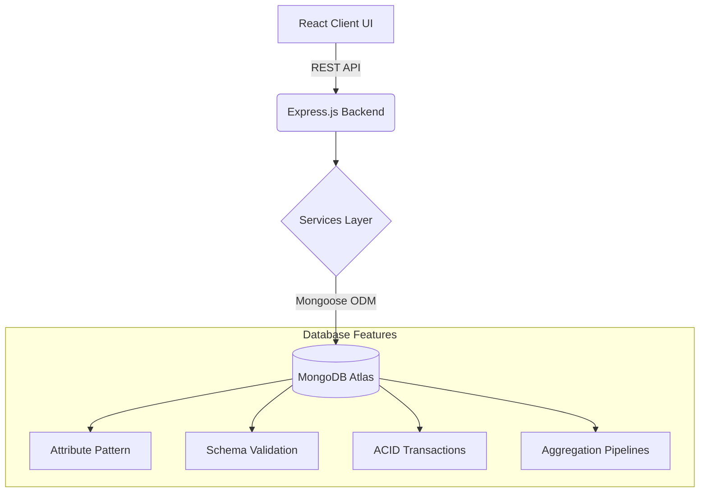

# 🛒 UrbanKart
**Intelligent NoSQL E-Commerce Platform**

*A comprehensive demonstration of advanced document-oriented database design, flexible schema management, and performance optimization techniques for CSE494.*

## 📖 Overview
UrbanKart is a multi-vendor e-commerce platform built as an academic capstone. It transcends a basic CRUD application to explore intelligent NoSQL capabilities, including embedding vs. referencing, the Attribute Pattern, and MongoDB transactions, to solve real-world relational bottlenecks.

## 🏗️ High-Level Architecture
UrbanKart processes operations through a clean, decoupled SOA (Service-Oriented Architecture):

### 🧩 Core Modules
| Module | Purpose | Technology | Status |
|---|---|---|---|
| **M1 – Database Foundation** | Schema design & validation | MongoDB, Mongoose | 🟢 Planned |
| **M2 – Express API Core** | RESTful routing & controllers | Node.js, Express | 🟢 Planned |
| **M3 – Authentication** | Secure vendor/user access | JWT, bcrypt | 🟢 Planned |
| **M4 – E-Commerce Engine** | Cart & Checkout Transactions | MongoDB Transactions | 🟢 Planned |
| **M5 – Intelligent Analytics** | Complex queries & recommendations | MongoDB Aggregations | 🟢 Planned |
| **M6 – React Client** | Interactive frontend portal | React, TailwindCSS | 🟢 Planned |

## 🛠️ Technology Stack

<b>View Tech Stack</b>

- **Frontend:** React.js, TailwindCSS
- **Backend:** Node.js, Express.js
- **Database:** MongoDB Atlas, Mongoose ODM
- **Authentication:** JSON Web Tokens (JWT)
- **Infrastructure:** Git, GitHub Monorepo

## 📅 Day-wise Roadmap
* **Day 1: Project Foundation** (Monorepo, GitHub setup)
* **Day 2: Database Schemas** (Mongoose, Attribute Pattern)
* **Day 3: Core API & Auth** (Express, JWT)
* **Day 4: Checkout & Transactions** (MongoDB ACID)
* **Day 5: Intelligent Analytics** (Aggregation Pipelines)
* **Day 6: React Frontend & Review** (UI Integration)

## 🚦 Current Implementation Status
**Current Phase: Day 1 — Monorepo Foundation & Initial Setup**
- [x] **Repository Setup:** Complete
- [x] **Environment Configuration:** Complete
- [x] **Monorepo Structure:** Complete
- [ ] **MongoDB Atlas Setup:** Not started
- [ ] **Mongoose Models:** Planned
- [ ] **Express API:** Planned

## 📂 Repository Structure
- `server/` - Node.js/Express Backend and MongoDB logic
- `client/` - React Frontend (To be added)
- `docs/` - Planning, roadmap, and project documentation
- `.github/workflows/` - CI automation
- `.env.example` - Environment variables template

## 🎓 Learning & Engineering Philosophy
UrbanKart is built incrementally. Each stage focuses on understanding *why* a NoSQL architectural decision is made (e.g., Embedding vs. Referencing) rather than just making it work. This ensures deep comprehension for the CSE494 academic defense.

<b>UrbanKart</b> 
<i>Intelligent NoSQL E-Commerce Platform</i> 
Built for CSE494 Intelligent NoSQL Databases. 
 

