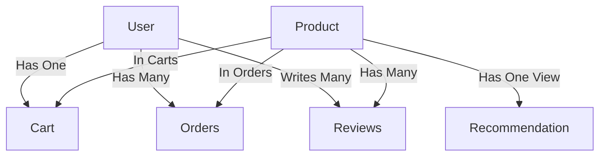
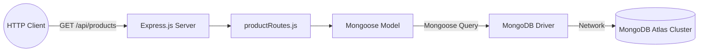

> **Note:** This document preserves the Day-1 learning and implementation history of UrbanKart. It is intended as a development/learning artifact and may be reorganized or removed before final submission if the final documentation structure requires it.

# 🌆 UrbanKart — Day 1 Foundation & Core NoSQL Backend

## 1. Day 1 Objective
The primary objective of Day 1 was to establish the foundational backend architecture for UrbanKart. Before building complex features like user authentication or payment processing, we needed a rock-solid, validated, and initialized database schema that accurately reflects the business domain.

**IMPLEMENTED ON DAY 1:**
- Express & Mongoose environment setup.
- Core Mongoose models (User, Cart, Product, Order, Review, Recommendation).
- MongoDB `$jsonSchema` database-level validation (The Database Firewall).
- Attribute Pattern for extensible product catalogs.
- Realistic development seed data insertion.
- The foundational `GET /api/products` API endpoint.
- `/api/health` system check endpoint.

**PLANNED FOR LATER DAYS:**
- Full CRUD operations.
- User authentication & JWT.
- React frontend development.
- Complex aggregations & real-time analytics.
- Actual recommendation engine logic.

---

## 2. What Is UrbanKart?
UrbanKart is a modern, scalable e-commerce platform. It demonstrates how to handle complex, highly-variable product catalogs, dynamic shopping carts, immutable order histories, and product reviews at scale. 

The project heavily relies on **MongoDB** and **NoSQL concepts** because e-commerce data is inherently unstructured and hierarchical. A laptop has vastly different specifications than a t-shirt; a relational (SQL) database struggles with this polymorphism, often requiring sparse tables or complex `JOIN` operations. MongoDB allows us to embed this data natively. This project serves as a comprehensive capstone demonstrating the core tenets of **CSE494 Intelligent NoSQL Databases**.

---

## 3. Day 1 Scope and Boundary

| Area | Day 1 Status | Explanation |
|---|---|---|
| **Environment** | ✅ Implemented | Node.js, npm, dotenv configured. |
| **GitHub** | ✅ Implemented | Monorepo initialized with Conventional Commits. |
| **MongoDB Atlas** | ✅ Implemented | Cloud database configured and connected securely. |
| **Express & Mongoose** | ✅ Implemented | Server initialized; ODMs mapped to DB collections. |
| **Six Models** | ✅ Implemented | User, Cart, Product, Order, Review, Recommendation. |
| **Attribute Pattern** | ✅ Implemented | Dynamic key-value pairs for product variations. |
| **MongoDB Validation** | ✅ Implemented | Strict `$jsonSchema` firewall active on Atlas. |
| **Seed Data** | ✅ Implemented | 18 realistic items seeded for dev environment. |
| **GET /api/products** | ✅ Implemented | First endpoint successfully retrieving the catalog. |
| **Health endpoint** | ✅ Implemented | Diagnostic route for deployment monitoring. |
| **CRUD** | ❌ Planned | POST/PUT/DELETE for products/users come later. |
| **JWT / Auth** | ❌ Planned | Secure user login planned for Day 2+. |
| **React Frontend** | ❌ Planned | UI consumption comes after backend completion. |
| **Cart/Orders** | ❌ Planned | Models exist, but API operations are not yet built. |
| **Recommendations** | ❌ Planned | Schema exists, algorithmic population planned later. |
| **Analytics** | ❌ Planned | Aggregation pipelines planned for later phases. |

---

## 4. Technology Stack
*   **Node.js (v24.14.0):** The JavaScript runtime environment executing our backend logic.
*   **npm:** Package manager used to install dependencies (express, mongoose, dotenv).
*   **Express:** A minimalist web framework for Node.js routing and middleware handling.
*   **Mongoose:** The Object Data Modeling (ODM) library translating JS objects to MongoDB documents.
*   **MongoDB Atlas:** The cloud-hosted NoSQL database service storing our collections.
*   **Git & GitHub:** Version control system maintaining our implementation history.

---

## 5. Environment Verification
During setup, we explicitly verified our toolchain to prevent "works on my machine" errors:
```bash
node --version # Verified runtime compatibility
npm --version  # Verified package manager availability
git --version  # Verified source control availability
```
*(Node.js v24.14.0 was verified in the task runner logs).*

---

## 6. GitHub Repository Setup
We initialized a public repository (`charan21042005/urbankart`) licensed under MIT. 
*   **Why meaningful commits?** We enforce **Conventional Commits** (e.g., `feat(api): ...`, `style(seed): ...`) to ensure our git history reads like a professional changelog.
*   **The Workflow:** Build → Verify → Explain → Review → Commit → Push. We completely avoid "fake" or empty commits, ensuring every hash represents actual forward momentum or explicit refactoring.

---

## 7. Monorepo Architecture
Our current repository structure keeps the backend encapsulated inside the `server/` directory, preparing for a future `client/` directory.

```text
urbankart/
├── .env.example
├── .gitignore
└── server/
    ├── package.json
    ├── package-lock.json
    ├── server.js
    ├── models/
    │   ├── Cart.js
    │   ├── Order.js
    │   ├── Product.js
    │   ├── Recommendation.js
    │   ├── Review.js
    │   └── User.js
    ├── routes/
    │   └── productRoutes.js
    ├── scripts/
    │   ├── initDb.js
    │   └── testValidation.js
    └── seed/
        └── seedProducts.js
```

---

## 8. Environment Variables and Secrets
We created a root `.env` file (ignored by Git) and a `.env.example` file (tracked by Git).
*   **Why?** The `.env` file contains our `MONGODB_URI` and plaintext passwords. If committed, malicious actors could hijack our Atlas cluster within seconds via automated GitHub scraping bots.
*   **Example Usage:** `MONGODB_URI=<your-atlas-connection-string>`

---

## 9. MongoDB Atlas
**MongoDB Atlas** is a fully managed cloud database.
*   **Hierarchy:** `Atlas Cluster` → `urbankart database` → `Collections (e.g., products)` → `Documents (BSON)` → `Fields (e.g., name, ObjectId)`.
*   **Security:** We configured IP whitelisting and a dedicated database user to ensure only our server can negotiate a connection.

---

## 🧠 10. NoSQL Data Modeling Fundamentals
*   **Relational vs Document:** SQL normalizes data into tables linked by foreign keys. NoSQL embeds related data directly into documents when they are accessed together, reducing expensive `JOIN` operations.
*   **Embedding vs Referencing:** We embed data that is closely tied and rarely changes independently (e.g., product attributes). We reference data that scales unboundedly or is accessed independently (e.g., reviews).
*   **Historical Snapshotting:** E-commerce demands immutability for past events. If a user buys a $1,000 laptop and we later discount it to $800, their past receipt MUST still say $1,000.

---

## 11. UrbanKart Collection Architecture


---

## 📦 12. Product Model Deep Dive
```javascript
const productSchema = new mongoose.Schema({
  name: { type: String, required: true, trim: true },
  description: { type: String },
  price: { type: Number, required: true, min: 0 },
  stock: { type: Number, required: true, min: 0, default: 0, validate: { validator: Number.isInteger } },
  category: { type: String, required: true, trim: true },
  attributes: [attributeSchema]
}, { timestamps: true });
```
*   **Stock Validation:** We enforced `Number.isInteger`. You cannot buy 1.5 laptops.
*   **The Attribute Pattern:** `attributes: [{ key, value }]` allows us to sell a Laptop (`{"key": "RAM", "value": "16GB"}`) and a Shirt (`{"key": "Size", "value": "M"}`) in the same collection without hundreds of sparse fields.

---

## 👤 13. User Model Deep Dive
```javascript
const userSchema = new mongoose.Schema({
  name: { type: String, required: true, trim: true },
  email: { type: String, required: true, unique: true, lowercase: true, trim: true },
  passwordHash: { type: String, required: true },
  role: { type: String, enum: ['customer', 'admin'], default: 'customer' }
}, { timestamps: true });
```
*   **`unique: true`:** This is *not* a standard Mongoose validator; it instructs MongoDB to build a unique index in the database.
*   **`passwordHash`:** We store hashed versions of passwords (to be implemented via bcrypt on Day 2), ensuring a database breach doesn't expose plaintext user credentials.

---

## 🛒 14. Cart Model Deep Dive
```javascript
const cartSchema = new mongoose.Schema({
  userId: { type: mongoose.Schema.Types.ObjectId, ref: 'User', required: true, unique: true },
  items: [{
    productId: { type: mongoose.Schema.Types.ObjectId, ref: 'Product', required: true },
    quantity: { type: Number, required: true, min: 1, validate: { validator: Number.isInteger } }
  }]
});
```
*   **Why separate?** Carts change constantly. Embedding them in the `User` model would cause high write-churn on the user document.
*   **Why embed items?** A user's cart is retrieved all at once. Embedding the items array avoids querying a separate collection. (Using `_id: false` for subdocuments saves space).

---

## 📦 15. Order Model Deep Dive
```javascript
const orderItemSchema = new mongoose.Schema({
  productId: { type: mongoose.Schema.Types.ObjectId, ref: 'Product', required: true },
  nameAtPurchase: { type: String, required: true },
  priceAtPurchase: { type: Number, required: true, min: 0 },
  qty: { type: Number, required: true, min: 1, validate: { validator: Number.isInteger } }
}, { _id: false });
```
*   **Hybrid Reference + Snapshot Pattern:** We store a `ref` to the Product for analytics, but we *hardcopy* `nameAtPurchase` and `priceAtPurchase`. This guarantees that if a product is later deleted or repriced, the historical financial integrity of the order remains completely intact.

---

## ⭐ 16. Review Model Deep Dive
```javascript
const reviewSchema = new mongoose.Schema({
  productId: { type: mongoose.Schema.Types.ObjectId, ref: 'Product', required: true },
  userId: { type: mongoose.Schema.Types.ObjectId, ref: 'User', required: true },
  rating: { type: Number, required: true, min: 1, max: 5, validate: { validator: Number.isInteger } },
  comment: { type: String, trim: true }
}, { timestamps: true });
```
*   **Why separate?** A popular product might get 10,000 reviews. Embedding them in the `Product` document would exceed MongoDB's 16MB document limit (The Outlier Pattern / Unbounded Growth).

---

## 🤖 17. Recommendation Model Deep Dive
```javascript
const recommendationSchema = new mongoose.Schema({
  productId: { type: mongoose.Schema.Types.ObjectId, ref: 'Product', required: true, unique: true },
  relatedProducts: [{
    productId: { type: mongoose.Schema.Types.ObjectId, ref: 'Product', required: true },
    score: { type: Number, required: true } // Algorithm similarity score
  }],
  computedAt: { type: Date, required: true }
});
```
*   **Materialized View:** Computing related products on the fly is O(N). Instead, a future nightly batch job will compute similarities and save the results here. The API simply performs an O(1) read. (Note: Only the schema is implemented on Day 1, not the algorithm).

---

## 🧩 18. Mongoose Fundamentals
*   **MongoDB:** The actual database storing BSON.
*   **Mongoose:** The Node.js ODM library providing schema validation, casting, and business logic hooks.
*   **Schema vs Model:** A `Schema` defines the shape. A `Model` (`mongoose.model('Product', productSchema)`) compiles the schema into an actionable class capable of querying the database.

---

## 🛡️ 19. Validation — Two Layers

| Feature | Mongoose Validation (Layer 1) | MongoDB $jsonSchema (Layer 2) |
| :--- | :--- | :--- |
| **Execution** | Node.js Server | Atlas Database Engine |
| **Feedback** | Rich, user-friendly error messages | Harsh, native rejection (Code 121) |
| **Bypassable?** | Yes (e.g., editing via Compass) | No (Absolute Firewall) |

*   **Why both?** Mongoose gives great developer experience and catches bad data early. `$jsonSchema` guarantees that no other microservice, manual script, or bug can ever corrupt the underlying database.
*   *Note: Neither layer natively enforces referential integrity (foreign keys). `ref` in Mongoose is simply a hint for `.populate()`.*

---

## 🗄️ 20. MongoDB $jsonSchema Validation
We applied strict BSON type validation natively:
```json
"price": { "bsonType": "number", "minimum": 0 }
"stock": { "bsonType": "int", "minimum": 0 }
```
We intentionally omitted `"additionalProperties": false` to preserve the flexible nature of NoSQL early in development while strictly locking down the required critical paths.

---

## 🧪 21. Validation Testing
We successfully executed `server/scripts/testValidation.js` which bypassed Mongoose entirely using the native MongoDB driver:
*   ✅ **Valid product accepted:** `insertOne()` succeeded.
*   ✅ **Negative price rejected:** Document Validation Failure (Error 121).
*   ✅ **Missing User role rejected:** Document Validation Failure (Error 121).

---

## 🌱 22. Seed Data
To ensure our API and frontend have realistic data during development, we created `server/seed/seedProducts.js`.
*   We seeded **18 products** across 3 categories (Electronics, Apparel, Groceries).
*   We utilized the Attribute Pattern natively (e.g. `{"key": "processor", "value": "Intel Core i7"}`).
*   Verified via `node server/scripts/verify.js` retrieving accurate counts and clean schemas directly from Atlas.

---

## 🌐 23. Express Fundamentals
Express is our routing layer. When a client makes an HTTP request, the Express **server** listens, routes the path (e.g., `/api/products`), executes a callback function to interact with our database, and constructs an HTTP **response**.

---

## 🔗 24. First API Endpoint
The request flow for `GET /api/products`:
`Client` ➡️ `HTTP GET` ➡️ `Express (/api/products)` ➡️ `Product Router` ➡️ `Mongoose (Product.find({}))` ➡️ `MongoDB Atlas` ➡️ `BSON Documents` ➡️ `Express res.json()` ➡️ `HTTP 200` ➡️ `Client`.

---

## 🧑‍💻 25. Product Route Code Breakdown
```javascript
const express = require('express');
const router = express.Router();
const Product = require('../models/Product'); // 1. Import ODM

router.get('/', async (req, res) => { // 2. Define route
  try {
    const products = await Product.find({}); // 3. Query Atlas
    res.status(200).json(products); // 4. Return HTTP 200 JSON
  } catch (error) {
    console.error('Error fetching products:', error.message);
    res.status(500).json({ // 5. Safe, sanitized HTTP 500 error
      status: 'error',
      message: 'Failed to retrieve products from the database.'
    });
  }
});
module.exports = router;
```

---

## ❤️ 26. Health Endpoint
`GET /api/health` returns a simple `{ status: 'success' }` JSON. It proves the Express server is listening to requests independently of the database. Essential for load balancers and deployment verification.

---

## 🏗️ 27. Backend Startup Flow
1. Load `dotenv` variables.
2. `mongoose.connect(MONGODB_URI)`.
3. If successful, `app.listen(PORT)`.
*   **Why wait?** Starting Express *after* the DB connects ensures our API never accepts incoming traffic if the database is dead.

---

## 🧭 28. End-to-End Day 1 Architecture


---

## 🧪 29. API Testing Results
*   **`GET /api/health`:** Returned HTTP 200 Success.
*   **`GET /api/products`:** Returned HTTP 200 with an array of 18 meticulously structured JSON products representing our seeded catalog.

---

## 🐛 30. Problems and Fixes
*   **Problem:** Mongoose `Product.stock` allowed fractional values (1.5), but our DB `$jsonSchema` strictly enforced `bsonType: "int"`.
*   **Investigation:** Caught during code review before DB insertion.
*   **Fix:** Added `validate: { validator: Number.isInteger }` to Mongoose to ensure the application fails gracefully *before* hitting the DB firewall.
*   **Problem:** Minor trailing whitespace caught in `seedProducts.js` and `productRoutes.js`.
*   **Fix:** Cleaned via explicit commits (`style(api)`).

---

## 🌳 31. Final Repository Tree
```text
urbankart/
├── .env
├── .env.example
├── .gitignore
├── _day-notes/
│   └── day-01/
│       └── DAY_01_FOUNDATION_REPORT.md
└── server/
    ├── package.json
    ├── package-lock.json
    ├── server.js
    ├── models/
    │   ├── Cart.js, Order.js, Product.js, Recommendation.js, Review.js, User.js
    ├── routes/
    │   └── productRoutes.js
    ├── scripts/
    │   ├── initDb.js, testValidation.js, verify.js
    └── seed/
        └── seedProducts.js
```

---

## 📝 32. Git History
```text
89d4bce style(api): clean product route whitespace
3f8bbb1 feat(api): add product listing endpoint
62a618f feat(api): create product routes handler
2778978 style(seed): clean seed script whitespace
8550879 feat(seed): add UrbanKart sample product catalog
4576ef1 feat(db): enforce MongoDB document validation
69488bd fix(models): enforce integer validation for Product stock
506e046 feat: add Recommendation Mongoose model
d7125a6 feat: add Review Mongoose model
8905dc5 feat: add Order Mongoose model
deea16f feat: add Cart Mongoose model
40203a1 feat: add User Mongoose model
```
*Conventional commits provide automated changelogs and explicit historical context.*

---

## 🎓 33. CSE494 Concepts Demonstrated

| CSE494 Concept | UrbanKart Implementation | Status |
| :--- | :--- | :--- |
| **Document DB / BSON** | Using MongoDB Atlas for all storage. | ✅ Implemented |
| **NoSQL Modeling** | User, Cart, Product collections. | ✅ Implemented |
| **Embedding** | `Cart.items`, `Product.attributes`. | ✅ Implemented |
| **Referencing** | `Review.productId`, `Order.customerId`. | ✅ Implemented |
| **Attribute Pattern** | Handling variable product specs. | ✅ Implemented |
| **Snapshot Pattern** | Storing `priceAtPurchase` historically. | ✅ Implemented |
| **Validation Layers** | Mongoose + Database `$jsonSchema`. | ✅ Implemented |
| **Materialized View** | `Recommendation` pre-computed schema. | ✅ Implemented |
| **Aggregation Pipelines** | Complex read operations. | ❌ Future |
| **Transactions (ACID)** | Multi-document checkout logic. | ❌ Future |

---

## 🎤 34. Viva Questions

1. **What is MongoDB?** A NoSQL document database that stores data in flexible, JSON-like BSON formats.
2. **What is Mongoose?** An Object Data Modeling (ODM) library for MongoDB and Node.js.
3. **What is BSON?** Binary JSON, which supports advanced types like Dates and ObjectIds.
4. **What is an ObjectId?** A 12-byte unique identifier natively generated by MongoDB.
5. **What is Embedding?** Storing related data within a single document (e.g., Cart items).
6. **What is Referencing?** Storing the ID of another document (like a relational foreign key).
7. **What is the Attribute Pattern?** Using a key/value array to handle diverse, unpredictable fields without breaking the schema.
8. **What is the Snapshot Pattern?** Copying data (like price) into a new document to preserve history.
9. **Why use both Mongoose and $jsonSchema validation?** Mongoose provides a friendly application layer; `$jsonSchema` acts as an un-bypassable database firewall.
10. **What is Express?** A minimal Node.js framework for building APIs and handling HTTP requests.
11. **What is REST?** Representational State Transfer — an architectural style for designing networked applications.
12. **What does GET do?** Retrieves a resource safely without modifying database state.
13. **What is HTTP 200?** Standard response for a successful HTTP request.
14. **What is HTTP 500?** Internal Server Error; indicates a crash or unhandled exception.
15. **Why separate the Review collection?** To prevent the Product document from exceeding the 16MB limit due to unbounded growth.
16. **Why embed Cart items?** They are intrinsically linked to the Cart and always read together.
17. **Why use `_id: false` in embedded schemas?** To save storage space when the subdocument will never be queried independently.
18. **What is a Materialized View?** Pre-computing heavy read operations (like recommendations) and storing them for instant O(1) access.
19. **What does `unique: true` do in Mongoose?** It builds a database-level unique index, it is not a standard validation hook.
20. **Why load the DB before Express starts?** So the server doesn't accept client requests if it has nowhere to process the data.
21. **What is a Schema?** The structural definition of the document constraints.
22. **What is a Model?** The compiled JS class used to query the database based on the Schema.
23. **What is `dotenv`?** A module that loads environment variables from a `.env` file into `process.env`.
24. **Why ignore `.env` in Git?** To prevent catastrophic leaks of database passwords and secret keys.
25. **What does `res.json()` do?** Converts a JS object/array into a JSON string and sends it with the proper HTTP headers.

---

## 💼 35. Interview Questions

*   **Why MongoDB instead of PostgreSQL?** "E-commerce catalogs are highly polymorphic. A laptop has wildly different specs than a shirt. MongoDB handles this fluid schema elegantly via the Attribute Pattern without sparse tables."
*   **Why did you embed Cart items?** "Data that is accessed together should be stored together. A user never queries a single cart item independently."
*   **Why is Order using priceAtPurchase?** "Historical integrity. If we discount a product tomorrow, previous orders must still reflect the price the user actually paid."
*   **Why use MongoDB validation if Mongoose already validates?** "Defense in depth. If a data science script in Python connects to our Atlas cluster, Mongoose is bypassed. `$jsonSchema` protects the data integrity at the metal level."
*   **What happens if MongoDB becomes unavailable?** "Our `catch` block intercepts the Mongoose timeout/error and returns an HTTP 500 JSON response, preventing the Node server from crashing."

---

## ⚠️ 36. Common Mistakes (To Avoid)
*   **Storing plaintext passwords:** Always hash credentials (planned for Day 2).
*   **Confusing `ref` with foreign keys:** Mongoose `ref` doesn't enforce referential integrity natively.
*   **Embedding unlimited reviews:** Leads to 16MB BSON size limit crashes.
*   **Allowing fractional stock:** E-commerce physical items must strictly use `Number.isInteger`.
*   **Committing `.env`:** The fastest way to get your cluster hijacked.

---

## 🧠 37. What I Should Be Able to Explain After Day 1
- [x] Explain MongoDB document / BSON
- [x] Explain collection / ObjectId
- [x] Explain embedding vs referencing
- [x] Explain Attribute Pattern
- [x] Explain Mongoose Schema vs Model
- [x] Explain MongoDB `$jsonSchema`
- [x] Explain Product model & Order snapshot fields
- [x] Trace an API request (`GET /api/products`)
- [x] Explain HTTP 200/500
- [x] Explain `.env` vs `.env.example`
- [x] Explain Git Conventional Commits

---

## 📋 38. Day 1 Definition of Done
*   [x] GitHub Repository Initialized
*   [x] Environment Variables Configured
*   [x] Atlas Cluster Connected
*   [x] 6 Core Models Implemented
*   [x] MongoDB Validation Firewall Deployed
*   [x] Native DB Testing Executed
*   [x] Seed Data Inserted
*   [x] API Endpoint `GET /api/products` Working
*   [x] `GET /api/health` Working
*   [x] Clean Git History

---

## 🏁 39. Final Day 1 State
**WHERE WE STARTED:** An empty folder.
**WHAT WE BUILT:** A robust, validated, documented NoSQL foundation connected to Atlas with a live API endpoint serving product data.
**WHAT WE VERIFIED:** The database firewall natively rejects bad data, and our Express API successfully fetches the seeded catalog.
**WHERE THE REPO STANDS:** A perfectly clean working tree with 13 sequential, descriptive commits.

---

## 🚀 40. Day 2 Preview (FUTURE)
In Day 2, we will expand this foundation to include:
*   Full Product CRUD operations (`POST`, `PUT`, `DELETE`).
*   User registration and bcrypt password hashing.
*   JWT authentication implementation.
*   Protected routes requiring Bearer tokens.
*(None of these features are currently implemented).*
