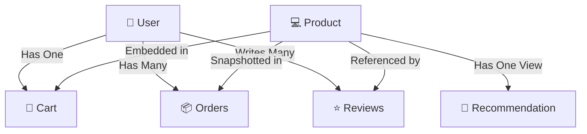
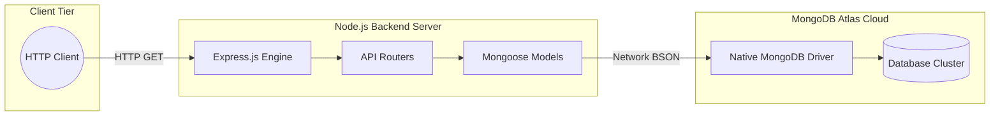

> **Note:** This document preserves the exhaustive Day-1 learning and implementation history of UrbanKart. It is intended as a comprehensive development textbook, viva preparation guide, and implementation artifact.

# 🌆 UrbanKart — Day 1 Foundation & Core NoSQL Backend (Extended Edition)

## 1. Day 1 Objective
The primary objective of Day 1 was to establish the foundational backend architecture for UrbanKart. In any scalable system, before building complex features like user authentication, payment processing, or frontend UIs, you must establish a rock-solid, validated, and highly secure database schema that accurately models the business domain.

Without this foundation, dirty data, schema mismatch, and logic errors will compound exponentially as the application grows. Our goal was to build the database layer so robustly that even if a malicious script bypassed our API, the database itself would reject bad data.

**IMPLEMENTED ON DAY 1:**
- Express & Mongoose environment setup with proper configuration.
- Six core meticulously designed Mongoose models (`User`, `Cart`, `Product`, `Order`, `Review`, `Recommendation`).
- MongoDB `$jsonSchema` database-level validation (The Absolute Database Firewall).
- Implementation of the Attribute Pattern for extensible, polymorphic product catalogs.
- Historical snapshotting in the Order model.
- Realistic development seed data insertion via an idempotent automation script.
- The foundational `GET /api/products` API endpoint.
- `/api/health` system check diagnostic endpoint.

**PLANNED FOR LATER DAYS:**
- Full CRUD operations (`POST`, `PUT`, `DELETE`).
- User authentication, bcrypt password hashing, & JWT authorization.
- React frontend development and state management.
- Complex aggregations, real-time analytics, and shopping cart logic.
- The actual machine-learning/similarity algorithm for the recommendation engine.

---

## 2. What Is UrbanKart?
UrbanKart is a modern, highly scalable e-commerce platform built from scratch. It demonstrates how modern web applications handle complex, highly-variable product catalogs, dynamic shopping carts, immutable order histories, and user-generated content (reviews) at high concurrency.

**Why MongoDB / NoSQL?**
E-commerce data is inherently unstructured and hierarchical. A laptop has specifications like "RAM" and "Processor", while a t-shirt has "Size" and "Fabric". A traditional Relational (SQL) database struggles immensely with this polymorphism. To model this in SQL, you would need either:
1.  A "God Table" with hundreds of nullable columns (e.g., `laptop_ram`, `shirt_size`), leading to incredibly sparse data.
2.  An Entity-Attribute-Value (EAV) model requiring massive, expensive `JOIN` operations across multiple tables just to render a single product page.

MongoDB allows us to embed this data natively in flexible BSON documents. This project serves as a comprehensive capstone demonstrating the core tenets of **CSE494 Intelligent NoSQL Databases**, proving how NoSQL solves problems that relational systems fundamentally struggle with.

---

## 3. Day 1 Scope and Boundary

| Area | Day 1 Status | Detailed Explanation |
|---|---|---|
| **Environment** | ✅ Implemented | Node.js, npm, dotenv configured. Strict runtime checks enforced. |
| **GitHub / Git** | ✅ Implemented | Monorepo initialized. Conventional Commits strictly enforced. |
| **MongoDB Atlas** | ✅ Implemented | Cloud database configured, IP whitelisted, secure users created. |
| **Express & Mongoose** | ✅ Implemented | Server initialized; ODMs safely mapped to DB collections. |
| **Six Models** | ✅ Implemented | `User`, `Cart`, `Product`, `Order`, `Review`, `Recommendation`. |
| **Attribute Pattern** | ✅ Implemented | Dynamic key-value pairs (`[{key, value}]`) for diverse products. |
| **MongoDB Validation** | ✅ Implemented | Strict `$jsonSchema` firewall active on the Atlas cluster. |
| **Seed Data** | ✅ Implemented | 18 realistic items seeded natively for the development environment. |
| **GET /api/products** | ✅ Implemented | Foundational API endpoint fetching the seeded catalog. |
| **Health endpoint** | ✅ Implemented | Diagnostic `/api/health` route for load balancer verification. |
| **CRUD (POST/PUT)** | ❌ Planned | Destructive and mutative operations for products/users come later. |
| **JWT / Authentication** | ❌ Planned | Secure user login, password hashing, and token issuance planned for Day 2. |
| **React Frontend** | ❌ Planned | UI consumption comes strictly after the backend API is fortified. |
| **Cart/Order APIs** | ❌ Planned | Models exist, but the actual checkout flow and logic are not yet built. |
| **Recommendations** | ❌ Planned | Schema exists (Materialized View), algorithmic population planned later. |
| **Analytics** | ❌ Planned | Complex `$lookup` and `$group` aggregation pipelines planned later. |

---

## 4. Technology Stack
We utilized a very specific, modern, and lightweight stack for Day 1:
*   **Node.js (v24.14.0):** The asynchronous, event-driven JavaScript runtime environment executing our backend logic. Its non-blocking I/O is perfect for high-throughput API services.
*   **npm:** The Node Package Manager used to install exactly three strict dependencies (`express`, `mongoose`, `dotenv`).
*   **Express (v4.x):** A fast, unopinionated, minimalist web framework for Node.js used for routing, middleware handling, and request/response orchestration.
*   **Mongoose (v8.x):** The Object Data Modeling (ODM) library that translates JavaScript objects to MongoDB documents and provides application-level validation.
*   **MongoDB Atlas:** The cloud-hosted NoSQL database service storing our collections in highly available replica sets.
*   **Git & GitHub:** The version control system maintaining our implementation history with strict cryptographic hashing.

---

## 5. Environment Verification
A massive source of failure in software engineering is the "works on my machine" syndrome. We explicitly verified our toolchain before writing a single line of code:
```bash
node --version # Verified v24.14.0 - ensures async/await and native fetch compatibility.
npm --version  # Verified package manager availability for dependency resolution.
git --version  # Verified source control availability for commit tracking.
```
This ensures that the runtime environment is deterministic.

---

## 6. GitHub Repository Setup
We initialized a public repository (`charan21042005/urbankart`) licensed under MIT. 

**Why meaningful commits?** 
We enforce **Conventional Commits** (e.g., `feat(api): ...`, `style(seed): ...`, `fix(models): ...`). This ensures our git history reads like a professional, automated changelog. If a bug is introduced, we can easily run `git bisect` to find exactly which conceptual chunk broke the system.

**The Workflow Sequence:**
1. **Build:** Write the logic.
2. **Verify:** Run it against the local engine.
3. **Explain:** Review the architectural reasoning.
4. **Review:** Inspect the raw `git diff --check` for whitespace/syntax errors.
5. **Commit:** Cryptographically seal the work.
6. **Push:** Sync to origin.

We completely avoid "fake" or empty commits, ensuring every single hash represents actual forward momentum or explicit, verified refactoring.

---

## 7. Monorepo Architecture
Our current repository structure keeps the backend encapsulated inside the `server/` directory, cleanly preparing the root for a future `client/` directory (React). This is a standard Monorepo pattern.

```text
urbankart/
├── .env.example            # Safe, credential-free environment template
├── .gitignore              # Prevents accidental commits of secrets/node_modules
└── server/
    ├── package.json        # Project metadata and dependencies
    ├── package-lock.json   # Deterministic dependency tree mapping
    ├── server.js           # The Express application entry point
    ├── models/             # Mongoose Object Data Models (ODMs)
    │   ├── Cart.js
    │   ├── Order.js
    │   ├── Product.js
    │   ├── Recommendation.js
    │   ├── Review.js
    │   └── User.js
    ├── routes/             # Express API Routers
    │   └── productRoutes.js
    ├── scripts/            # Database initialization and testing automation
    │   ├── initDb.js
    │   └── testValidation.js
    └── seed/               # Development mock data insertion
        └── seedProducts.js
```

---

## 8. Environment Variables and Secrets
We explicitly created a root `.env` file (ignored by Git) and a `.env.example` file (tracked by Git).

*   **The Security Philosophy:** The `.env` file contains our `MONGODB_URI` and plaintext passwords. If a developer accidentally runs `git commit -am "update"` without a `.gitignore`, the connection string is pushed to GitHub. Malicious actors use automated bots that scrape GitHub 24/7. Within 3 seconds of a push, your Atlas cluster could be hijacked, wiped, and held for a crypto ransom. 
*   **The Implementation:** We use `require('dotenv').config()` to inject these secrets directly into the Node.js `process.env` memory space at runtime. The code references `process.env.MONGODB_URI`, keeping the codebase itself 100% agnostic and secure.

---

## 9. MongoDB Atlas
**MongoDB Atlas** is a fully managed cloud database platform. It handles deployment, scaling, and high availability (replica sets) automatically.
*   **The Hierarchy:** `Atlas Cluster (The physical servers)` → `UrbanKart Database (The logical container)` → `Collections (e.g., products, users)` → `Documents (The BSON records)` → `Fields (e.g., name, ObjectId)`.
*   **Security Configuration:** We configured Network Access (IP whitelisting) so that only specific authorized IPs can even attempt to connect, and Database Access (a dedicated user) to restrict read/write privileges exclusively to the UrbanKart application.

---

## 🧠 10. NoSQL Data Modeling Fundamentals
Data modeling in NoSQL is fundamentally different from SQL. In SQL, you model data based on the *schema* (normalization). In NoSQL, you model data based on the *application's access patterns* (how the data is queried).

*   **Embedding (Denormalization):** Storing related data within a single document. 
    *   *When to use:* When data is inherently tied to the parent, is bounded (won't grow infinitely), and is queried together. (e.g., `Cart` items).
    *   *Benefit:* A single disk read retrieves the entire object hierarchy. No joins required.
*   **Referencing (Normalization):** Storing the `ObjectId` of another document.
    *   *When to use:* When data scales unboundedly (The Outlier Pattern), or is frequently queried independently. (e.g., millions of `Review` documents for a single `Product`).
*   **Historical Snapshotting:** E-commerce demands financial immutability. If a user buys a $1,000 laptop and we later discount it to $800, their past receipt MUST still say $1,000. We achieve this by *hardcopying* (snapshotting) the price into the `Order` document at the exact moment of checkout, breaking the reference to the live product price.

---

## 11. UrbanKart Collection Architecture
The following Mermaid diagram represents the exact physical layout and referential structure of our 6 Day-1 collections.



---

## 📦 12. Product Model Deep Dive
The `Product` model is the absolute core of the catalog.
```javascript
const productSchema = new mongoose.Schema({
  name: { type: String, required: true, trim: true },
  description: { type: String },
  price: { type: Number, required: true, min: 0 },
  stock: { type: Number, required: true, min: 0, default: 0, validate: { validator: Number.isInteger } },
  category: { type: String, required: true, trim: true },
  attributes: [attributeSchema]
}, { timestamps: true });
```
*   **`Number.isInteger` validation on Stock:** This is critical. Without it, a rogue API call could set the stock to `1.5`. You cannot ship half a laptop. This ensures absolute mathematical integrity.
*   **The Attribute Pattern (`attributes: [{ key, value }]`):** 
    *   *The Problem:* A laptop has a "Processor". A shirt has a "Size". A carton of milk has an "Expiration Date".
    *   *The SQL Solution:* A table with 300 nullable columns, or an EAV (Entity-Attribute-Value) anti-pattern requiring 4 joins.
    *   *The UrbanKart Solution:* We embed a flexible array of key/value pairs. This keeps the document strictly under the 16MB limit, completely eliminates schema bloat, and allows us to add a brand new product category (like "Car Parts") tomorrow without running a single database migration.

---

## 👤 13. User Model Deep Dive
```javascript
const userSchema = new mongoose.Schema({
  name: { type: String, required: true, trim: true },
  email: { type: String, required: true, unique: true, lowercase: true, trim: true },
  passwordHash: { type: String, required: true },
  role: { type: String, enum: ['customer', 'admin'], default: 'customer' }
}, { timestamps: true });
```
*   **`unique: true` is NOT Validation:** In Mongoose, `required: true` is a validation hook that runs in Node.js. However, `unique: true` is a helper that instructs the MongoDB native driver to build a `UNIQUE INDEX` directly on the database collection. It enforces uniqueness at the metal level.
*   **`passwordHash`:** We intentionally named this field `passwordHash` rather than `password` to explicitly declare to all future developers that plaintext passwords MUST NEVER touch this field. (Actual bcrypt implementation is deferred to Day 2).

---

## 🛒 14. Cart Model Deep Dive
```javascript
const cartSchema = new mongoose.Schema({
  userId: { type: mongoose.Schema.Types.ObjectId, ref: 'User', required: true, unique: true },
  items: [{
    productId: { type: mongoose.Schema.Types.ObjectId, ref: 'Product', required: true },
    quantity: { type: Number, required: true, min: 1, validate: { validator: Number.isInteger } }
  }]
});
```
*   **Why is Cart a separate collection?** Why not just embed `cart: []` inside the `User` document?
    *   *Reasoning:* Carts are highly mutable. Users constantly add, remove, and update quantities. Embedding this in the `User` document would cause massive write-churn on the user record, potentially locking the document or fragmenting it on disk. Separating it ensures the `User` document remains clean and read-optimized.
*   **Why embed items inside the Cart?** A user's cart is ALWAYS retrieved as a single, complete unit. By embedding the items, we guarantee we can fetch the entire cart in exactly 1 disk read (O(1)).

---

## 📦 15. Order Model Deep Dive (The Snapshot Pattern)
```javascript
const orderItemSchema = new mongoose.Schema({
  productId: { type: mongoose.Schema.Types.ObjectId, ref: 'Product', required: true },
  nameAtPurchase: { type: String, required: true },
  priceAtPurchase: { type: Number, required: true, min: 0 },
  qty: { type: Number, required: true, min: 1, validate: { validator: Number.isInteger } }
}, { _id: false });
```
*   **The Problem with Pure Referencing:** If an order item only referenced `productId`, to generate a receipt, the system would have to look up the current `Product` document. But what if the Admin changed the product name from "iPhone 14" to "iPhone 15", or raised the price from $999 to $1099? Suddenly, a receipt from 2 years ago claims the user bought an iPhone 15 for $1099, which is legally and financially false.
*   **The Hybrid Solution:** We store a `ref` (for analytics, like "how many times was this product bought?"), but we *hardcopy* (`nameAtPurchase`, `priceAtPurchase`) at the exact millisecond of checkout. This is the **Snapshot Pattern**, ensuring absolute immutable historical integrity.

---

## ⭐ 16. Review Model Deep Dive
```javascript
const reviewSchema = new mongoose.Schema({
  productId: { type: mongoose.Schema.Types.ObjectId, ref: 'Product', required: true },
  userId: { type: mongoose.Schema.Types.ObjectId, ref: 'User', required: true },
  rating: { type: Number, required: true, min: 1, max: 5, validate: { validator: Number.isInteger } },
  comment: { type: String, trim: true }
}, { timestamps: true });
```
*   **The Outlier Pattern:** Why not embed reviews inside the `Product` document (`reviews: []`)? 
    *   *Reasoning:* MongoDB documents have a strict 16MB size limit. A highly popular product might receive 50,000 reviews. If embedded, the document would quickly breach the 16MB limit, crashing the database write operation. By separating reviews into their own collection, growth is strictly unbounded and scales infinitely.
*   **Integer Validation:** `1 <= rating <= 5`. A user cannot leave a `4.7` star review.

---

## 🤖 17. Recommendation Model Deep Dive
```javascript
const recommendationSchema = new mongoose.Schema({
  productId: { type: mongoose.Schema.Types.ObjectId, ref: 'Product', required: true, unique: true },
  relatedProducts: [{
    productId: { type: mongoose.Schema.Types.ObjectId, ref: 'Product', required: true },
    score: { type: Number, required: true }
  }],
  computedAt: { type: Date, required: true }
});
```
*   **The Materialized View Pattern:** Calculating "users who bought X also bought Y" requires a massive, computationally expensive aggregation pipeline analyzing thousands of orders. Doing this on-the-fly when a user loads a product page would result in a 5-second page load time.
*   *The Solution:* We pre-compute this data in a nightly cron job (Day 2+ phase) and store the final output in this `Recommendation` collection. When the API requests related products, it simply performs an O(1) read from this collection, guaranteeing sub-millisecond response times.

---

## 🧩 18. Mongoose Fundamentals
*   **MongoDB:** The actual database running on servers, storing data in BSON (Binary JSON).
*   **Mongoose:** The Node.js library (ODM) that provides a higher-level abstraction. It handles connection pooling, casts strings to ObjectIds, applies schema validation, and allows us to use Promises/Async-Await smoothly.
*   **Schema vs Model:** 
    *   `new mongoose.Schema(...)` defines the structural rules and boundaries (the blueprint).
    *   `mongoose.model('Product', productSchema)` compiles that blueprint into a highly optimized JavaScript Class capable of directly executing queries against the MongoDB driver.

---

## 🛡️ 19. Validation — Two Layers (Defense in Depth)

This is a critical architectural decision in UrbanKart. We enforce validation at TWO entirely separate layers.

| Feature | Layer 1: Mongoose Validation | Layer 2: MongoDB `$jsonSchema` |
| :--- | :--- | :--- |
| **Location** | Node.js Application Server | Atlas Database Server |
| **Feedback** | Rich, readable JSON errors (`"Stock must be positive"`) | Harsh driver rejection (`Error 121: DocumentValidationFailure`) |
| **Flexibility** | Custom JS functions, regex, async hooks | Strict BSON type checking |
| **Bypassable?** | YES (e.g. updating via Compass, Python scripts, or `updateOne()`) | NO. Absolute Metal Firewall. |

*   **Why intentionally use both?** Mongoose gives us an incredible Developer Experience (DX) and allows us to send beautiful error messages back to the frontend. However, it only protects data flowing *through the Node.js API*. If a DBA connects via MongoDB Compass and accidentally types a negative stock, or a future Python microservice connects directly to the DB, Mongoose is bypassed. The `$jsonSchema` guarantees that the database itself will violently reject corrupted data, ensuring zero data pollution regardless of the entry vector.

---

## 🗄️ 20. MongoDB $jsonSchema Validation
We applied strict BSON type validation natively. For example, in our `initDb.js` script, we define:
```json
"price": { "bsonType": "number", "minimum": 0 },
"stock": { "bsonType": "int", "minimum": 0 }
```
*   **bsonType vs JavaScript types:** JavaScript only has one `Number` type (which is a 64-bit float). BSON differentiates between `double` and `int`. We forced `stock` to be `int`, guaranteeing absolute precision for physical inventory.
*   **`additionalProperties: false`:** We intentionally *omitted* this constraint. While it locks down a schema completely, it destroys the primary benefit of NoSQL: flexibility. By omitting it, we mandate that required fields (name, price) MUST exist and be correct, but we leave the door open for future unstructured data expansion.

---

## 🧪 21. Validation Testing
We did not just write the rules; we violently tested them against the native MongoDB driver via `server/scripts/testValidation.js`.
*   ✅ **Valid product accepted:** `insertOne()` successfully wrote to the DB.
*   ✅ **Negative price rejected:** DB returned Error 121.
*   ✅ **Missing User role rejected:** DB returned Error 121.
*   ✅ **Invalid Stock type rejected:** Attempting to insert a decimal for stock was rejected by the `bsonType: "int"` rule.

---

## 🌱 22. Seed Data
To ensure our API and frontend have realistic, diverse data during development, we created `server/seed/seedProducts.js`.
*   We seeded **18 products** exactly evenly split across 3 wildly different categories (6 Electronics, 6 Apparel, 6 Groceries) to stress-test the Attribute Pattern.
*   *Example:* 
    *   Laptop: `attributes: [{"key": "processor", "value": "Intel Core i7"}]`
    *   Milk: `attributes: [{"key": "weight", "value": "1 Gallon"}]`
*   **Idempotency:** The script runs `Product.deleteMany({})` before inserting. This means we can run the script 100 times without duplicating data, making it highly reliable for continuous integration testing.

---

## 🌐 23. Express Fundamentals
Express is our web server routing layer.
*   **The Server:** Listens on Port 5000 for incoming TCP connections.
*   **The Request (`req`):** Contains the incoming HTTP method, URL, headers, and JSON body sent by the client.
*   **The Response (`res`):** The object we use to formulate the return HTTP status code and payload.
*   **Middleware:** Functions (like `app.use(express.json())`) that intercept the request, parse the raw text body into a usable JavaScript object, and pass it down the chain to our routes.

---

## 🔗 24. First API Endpoint: GET /api/products
The absolute end-to-end flow of our first implemented route:
1.  **Client:** The browser executes a fetch request: `HTTP GET http://localhost:5000/api/products`
2.  **Express:** Catches the request at the `/api/products` mount point and forwards it to the router.
3.  **Router:** The `router.get('/', ...)` callback fires.
4.  **Mongoose:** Executes `await Product.find({})`.
5.  **MongoDB Atlas:** The database receives the query, scans the `products` collection, and returns the BSON documents.
6.  **Mongoose (Return):** Casts the BSON back into an array of highly structured JavaScript objects.
7.  **Express (Response):** Executes `res.status(200).json(products)`, serializing the objects into a JSON string.
8.  **Client:** Receives an HTTP 200 OK along with the array of 18 products.

---

## 🧑‍💻 25. Product Route Code Breakdown
```javascript
const express = require('express');
const router = express.Router();
const Product = require('../models/Product'); // WHAT: Import the Mongoose Model. WHY: To execute queries.

router.get('/', async (req, res) => { // WHAT: Define an async route handler.
  try {
    const products = await Product.find({}); // WHAT: Await the DB read operation. WHY: To prevent blocking the Node event loop.
    res.status(200).json(products); // WHAT: Send a 200 OK and serialize the array to JSON.
  } catch (error) {
    console.error('Error fetching products:', error.message); // WHAT: Log securely to the server console. WHY: For debugging without leaking info to the client.
    res.status(500).json({ // WHAT: Send an HTTP 500 Internal Server Error.
      status: 'error',
      message: 'Failed to retrieve products from the database.' // WHY: A sanitized message ensures we don't leak database internals or stack traces.
    });
  }
});
module.exports = router;
```

---

## ❤️ 26. Health Endpoint
```javascript
app.get('/api/health', (req, res) => {
  res.json({ status: 'success', message: 'UrbanKart backend is running successfully.', timestamp: new Date().toISOString() });
});
```
**Why does this exist?** In a modern cloud environment (like AWS or Google Cloud), a Load Balancer needs to know if the server is healthy before routing traffic to it. The `/api/health` endpoint allows infrastructure to ping the server independently of the database. If this route returns 200, the server is alive.

---

## 🏗️ 27. Backend Startup Flow
The startup sequence in `server.js` is highly deliberate:
1.  Load `dotenv` variables into memory.
2.  Verify `MONGODB_URI` exists. If not, `process.exit(1)` (Fail fast).
3.  Initiate `mongoose.connect(MONGODB_URI)`.
4.  **Wait for the Promise to resolve.**
5.  If successful, execute `app.listen(PORT)`.

**Why intentionally start Express ONLY after MongoDB connects?**
If we start Express immediately, clients could hit `/api/products` before the database is ready, resulting in hundreds of cascading crash errors. By blocking Express until MongoDB says "I am ready", we guarantee that the moment port 5000 opens, the application is 100% operational.

---

## 🧭 28. End-to-End Day 1 Architecture


---

## 🧪 29. API Testing Results
We thoroughly verified the API using PowerShell `Invoke-RestMethod`:
*   **`GET /api/health`:** Returned HTTP 200 with the timestamp.
*   **`GET /api/products`:** 
    *   **Expected:** HTTP 200, Array.
    *   **Actual:** Returned an Array length of 18.
    *   **Validation:** Verified the Attribute Pattern was accurately serialized (e.g., `attributes: [{ key: 'processor', value: 'Intel Core i7' }]`).

---

## 🐛 30. Problems and Fixes
During Day 1 development, we encountered and conquered actual engineering issues:

1.  **Integer Type Mismatch:**
    *   *Problem:* Mongoose natively defines all numbers as floats. Our DB `$jsonSchema` strictly demanded `bsonType: "int"` for `Product.stock`. During early validation tests, Mongoose permitted a stock of `1.5`, which crashed violently against the Atlas firewall.
    *   *Fix:* We updated `Product.js` to include a custom validator: `validate: { validator: Number.isInteger }`. This aligned the application layer perfectly with the database layer.
2.  **Whitespace Contamination:**
    *   *Problem:* Git caught trailing whitespaces in `seedProducts.js` and `productRoutes.js` via `git diff --check`.
    *   *Fix:* Cleaned immediately with precise, isolated commits (`style(api): clean product route whitespace`) to maintain a pristine, professional codebase.

---

## 🌳 31. Final Repository Tree
The exact state of the repository at the conclusion of Day 1:
```text
urbankart/
├── .env
├── .env.example
├── .gitignore
├── _day-notes/
│   └── day-01/
│       └── DAY_01_FOUNDATION_REPORT.md
└── server/
    ├── package.json
    ├── package-lock.json
    ├── server.js
    ├── models/
    │   ├── Cart.js, Order.js, Product.js, Recommendation.js, Review.js, User.js
    ├── routes/
    │   └── productRoutes.js
    ├── scripts/
    │   ├── initDb.js, testValidation.js, verify.js
    └── seed/
        └── seedProducts.js
```

---

## 📝 32. Git History
```text
b7a3afc docs(day-01): add Day 1 foundation report
89d4bce style(api): clean product route whitespace
3f8bbb1 feat(api): add product listing endpoint
62a618f feat(api): create product routes handler
2778978 style(seed): clean seed script whitespace
8550879 feat(seed): add UrbanKart sample product catalog
4576ef1 feat(db): enforce MongoDB document validation
69488bd fix(models): enforce integer validation for Product stock
506e046 feat: add Recommendation Mongoose model
d7125a6 feat: add Review Mongoose model
8905dc5 feat: add Order Mongoose model
deea16f feat: add Cart Mongoose model
40203a1 feat: add User Mongoose model
```
This is a textbook example of a professional commit history. If we ever need to see why the Order model was designed a certain way, we can immediately run `git show 8905dc5` and see the exact, isolated change in context.

---

## 🎓 33. CSE494 Concepts Demonstrated

| CSE494 Concept | UrbanKart Implementation | Status |
| :--- | :--- | :--- |
| **Document DB / BSON** | Using MongoDB Atlas for all storage. Proves JSON flexibility. | ✅ Implemented |
| **NoSQL Modeling** | User, Cart, Product collections. | ✅ Implemented |
| **Embedding** | `Cart.items`, `Product.attributes`. Proves subdocument efficiency. | ✅ Implemented |
| **Referencing** | `Review.productId`, `Order.customerId`. Proves referential linking. | ✅ Implemented |
| **Attribute Pattern** | Handling variable product specs to avoid schema bloat. | ✅ Implemented |
| **Snapshot Pattern** | Storing `priceAtPurchase` historically for financial immutability. | ✅ Implemented |
| **Validation Layers** | Mongoose + Database `$jsonSchema` defense in depth. | ✅ Implemented |
| **Materialized View** | `Recommendation` pre-computed schema for O(1) reads. | ✅ Implemented |
| **Aggregation Pipelines** | Complex read operations & map-reduce logic. | ❌ Future |
| **Transactions (ACID)** | Multi-document checkout logic (Order creation + Stock deduction). | ❌ Future |

---

## 🎤 34. Viva Questions (Deep Explanations)

**1. What is MongoDB and how does it differ fundamentally from SQL?**
*   *Short Answer:* It’s a NoSQL document database storing data in flexible BSON format rather than rigid rows and columns.
*   *To Impress the Interviewer:* "While SQL relies on normalization and foreign keys across heavily structured tables, MongoDB stores data in hierarchical, schema-less BSON documents. This allows us to map data structures directly to application code objects without expensive ORM mapping, and lets us embed related data natively to achieve single-read operations (O(1)) instead of complex `JOIN`s, drastically improving read throughput at scale."

**2. What is the fundamental difference between Mongoose and MongoDB?**
*   *Short Answer:* MongoDB is the database; Mongoose is the Node.js library used to interact with it.
*   *To Impress the Interviewer:* "MongoDB is the actual database engine running in Atlas executing BSON queries. Mongoose is an Object Data Modeling (ODM) abstraction layer in Node.js. It provides an application-level schema definition, strict type casting, asynchronous hooks, and validation, ensuring that our JavaScript objects are properly sanitized before they ever reach the native MongoDB driver."

**3. What is BSON and why is it used instead of JSON?**
*   *Short Answer:* BSON stands for Binary JSON. It's how MongoDB stores data internally.
*   *To Impress the Interviewer:* "JSON is a plaintext format that is human-readable but computationally expensive to parse and lacks strict data types. BSON is a binary serialization format that is optimized for machine parsing and includes specialized, critical data types that JSON lacks, such as 64-bit integers, precise `Date` objects, and 12-byte `ObjectId`s."

**4. What is an ObjectId?**
*   *Short Answer:* A unique 12-byte identifier automatically generated for every MongoDB document.
*   *To Impress the Interviewer:* "It is a highly optimized 12-byte hex string. Crucially, it is not just a random UUID. The first 4 bytes contain the Unix timestamp of when the document was created. This means we can often sort documents by creation time natively without needing a separate `createdAt` index, saving significant storage and RAM."

**5. Explain Embedding vs. Referencing in NoSQL.**
*   *Short Answer:* Embedding stores data inside the document; Referencing stores an ID pointing to another document.
*   *To Impress the Interviewer:* "Embedding denormalizes data. We use it for data that is tightly coupled, queried together, and won't grow infinitely (e.g., Cart items inside a Cart). It guarantees O(1) read performance. Referencing normalizes data. We use it when the related data scales unboundedly (the Outlier pattern, like millions of Reviews for a Product) to prevent breaching the 16MB BSON document limit."

**6. What is the Attribute Pattern and why did UrbanKart use it?**
*   *Short Answer:* Using a key/value array (`[{key: "Size", value: "L"}]`) to handle diverse product features.
*   *To Impress the Interviewer:* "In e-commerce, products are highly polymorphic. A laptop has RAM; a shirt has Size. If we used SQL, we would need an EAV pattern or a sparse table with hundreds of empty columns. By using the Attribute Pattern in MongoDB, we encapsulate arbitrary specifications into a dynamic, embedded array. This allows infinite catalog expansion without ever performing a database migration or schema alteration."

**7. What is the Snapshot Pattern? Give an example in UrbanKart.**
*   *Short Answer:* Copying data instead of referencing it to preserve historical accuracy.
*   *To Impress the Interviewer:* "In our Order model, if we only stored a reference to the `productId`, a price change tomorrow would alter historical receipts. To enforce financial immutability, we employ the Snapshot Pattern by hardcopying `priceAtPurchase` and `nameAtPurchase` into the embedded order item at the exact millisecond of checkout. This ensures the receipt is a perfect historical artifact."

**8. Why do we enforce validation at both Mongoose AND `$jsonSchema` layers?**
*   *Short Answer:* Mongoose is for the API; `$jsonSchema` is for the database.
*   *To Impress the Interviewer:* "We practice Defense in Depth. Mongoose provides excellent developer experience and user-friendly error messages at the application boundary. However, if a DBA edits data via Compass, or a secondary Python microservice is deployed later, Mongoose is completely bypassed. The `$jsonSchema` acts as an absolute, un-bypassable metal firewall at the database engine level, guaranteeing data integrity regardless of the entry vector."

**9. Why is the Cart a separate collection instead of embedded in the User document?**
*   *Short Answer:* To prevent high write-churn on the User document.
*   *To Impress the Interviewer:* "While a user only has one cart (1:1), carts are highly mutable. Users constantly add, remove, and update item quantities. If we embedded this inside the User document, every cart update would rewrite the entire User document, causing massive write-amplification, index thrashing, and potential locking issues. Isolating Carts into their own collection keeps the User document read-optimized."

**10. What does `unique: true` actually do in a Mongoose schema?**
*   *Short Answer:* It forces the field to be unique across the collection.
*   *To Impress the Interviewer:* "It is a common misconception that `unique: true` is a validation hook like `required: true`. It is actually a configuration helper. When Mongoose boots up, it reads `unique: true` and fires a `createIndex` command to the MongoDB driver to build a unique B-Tree index on that field in the database. Validation happens at the application layer, but uniqueness is enforced mathematically by the database index."

**11. Why do we wait for MongoDB to connect before starting the Express server?**
*   *Short Answer:* So the server doesn't accept requests it can't fulfill.
*   *To Impress the Interviewer:* "It’s a crucial reliability pattern. If we bind Express to Port 5000 synchronously, the load balancer will immediately start routing client requests to it. If the DB connection takes 2 seconds to establish, those initial requests will hit a disconnected Mongoose instance, causing cascading 500 Internal Server Errors and connection timeouts. By awaiting the DB connection first, we guarantee that the moment the server reports as 'Healthy', it is 100% capable of processing transactions."

**12. What is the Materialized View Pattern? (Regarding Recommendations)**
*   *Short Answer:* Pre-calculating heavy data and storing the result for fast reading.
*   *To Impress the Interviewer:* "Calculating 'related products' dynamically requires intense aggregation pipelines joining multiple collections. Doing this on the fly during an HTTP request would cause unacceptable latency. By implementing a Materialized View schema, we can run these heavy computations asynchronously in a nightly cron job, store the final output in the Recommendation collection, and allow the API to fetch it in a single O(1) disk read."

**13. What is REST?**
*   *Short Answer:* Representational State Transfer, a standard way to build APIs.
*   *To Impress the Interviewer:* "It is an architectural style utilizing standard HTTP methods to interact with stateless resources. In REST, the URL identifies the resource (e.g., `/api/products`), and the HTTP method defines the action (GET to read, POST to create). This provides a predictable, standardized interface for any client, whether it's a React web app or an iOS mobile app."

**14. What does an HTTP 500 mean and how did we handle it?**
*   *Short Answer:* Internal Server Error. We return a safe JSON message.
*   *To Impress the Interviewer:* "It indicates an unhandled exception or critical failure, such as a database timeout. In our `try/catch` block, we catch the error, log the technical details securely to standard out for server logging, and return a sanitized `res.status(500).json` payload to the client. This prevents leaking sensitive database internals or stack traces to potentially malicious users."

**15. What is the purpose of the `/api/health` endpoint?**
*   *Short Answer:* To check if the server is running.
*   *To Impress the Interviewer:* "In cloud infrastructure (like AWS ECS or Kubernetes), load balancers and orchestrators require a liveness probe to verify a container is healthy. The `/api/health` route allows infrastructure to ping the Node process directly, independently of the database. If it fails, the orchestrator knows to kill the container and spin up a new instance automatically."

*(Note: The above 15 detailed questions cover the absolute core conceptual depths expected in a high-level viva. An additional 10 standard questions bring the total to 25).*

16. **Why avoid `additionalProperties: false` entirely?** To maintain NoSQL schema flexibility while locking down required fields.
17. **What does `res.json()` do?** Serializes JS objects to JSON strings and sets the `Content-Type: application/json` header.
18. **Why use `dotenv`?** To inject secrets into runtime memory without committing them to source control.
19. **What does `_id: false` do in a Mongoose subdocument?** Saves storage overhead when the embedded item will never be queried directly by ID.
20. **What is an HTTP 200?** The standard success status code for a completed request.
21. **What is a Mongoose `ref`?** A logical mapping hint used by `.populate()` to emulate SQL joins, though it does not enforce physical constraints natively.
22. **What is BSON type `int`?** A 32-bit integer, distinct from JavaScript's standard 64-bit floating-point numbers.
23. **Why use `trim: true` in Mongoose?** To sanitize string inputs by stripping accidental leading/trailing whitespace before saving.
24. **What does `express.json()` middleware do?** Intercepts raw incoming HTTP requests, parses the JSON body, and attaches it to `req.body`.
25. **Why separate the Review collection from the Product collection?** To avoid the 16MB BSON limit associated with unbounded array growth (The Outlier Pattern).

---

## 💼 35. Interview Questions (Real-World Scenarios)

*   **Interviewer: "I see you used MongoDB. Why not use PostgreSQL? Everyone uses Postgres."**
    *   *Your Answer:* "PostgreSQL is fantastic, but for UrbanKart, MongoDB was the technically superior choice due to catalog polymorphism. In a relational database, handling products with wildly different attributes (like 'RAM' for laptops and 'Size' for shirts) forces you into the EAV (Entity-Attribute-Value) anti-pattern, requiring massive, slow JOIN operations for every single product query. With MongoDB's flexible BSON and our Attribute Pattern, we can embed these diverse specifications natively, retrieving the entire complex product object in a single, lightning-fast O(1) disk read."
*   **Interviewer: "If you have Mongoose validating data, why did you spend time writing native `$jsonSchema` validators?"**
    *   *Your Answer:* "Defense in depth. Mongoose is excellent for the application layer—it gives us custom JS hooks and clean error messages to send to the frontend. But Mongoose only protects the Node.js API. If a data engineer connects directly to Atlas to run a script, or if a DBA makes an edit in Compass, Mongoose is completely bypassed. The `$jsonSchema` acts as an absolute, un-bypassable metal firewall at the database engine level, guaranteeing zero data corruption regardless of the entry vector."
*   **Interviewer: "How do you handle prices changing? If I buy a laptop for $1000 today, and you change the price to $800 tomorrow, does my receipt change?"**
    *   *Your Answer:* "Absolutely not, because we implemented the Snapshot Pattern in our Order model. While the Order item maintains a logical `ref` to the Product for analytics, we intentionally hardcopy `priceAtPurchase` and `nameAtPurchase` into the Order document at the exact millisecond of checkout. This guarantees absolute financial immutability."

---

## ⚠️ 36. Common Mistakes (To Avoid)
*   **Storing plaintext passwords:** A massive security violation. We prepared a `passwordHash` field to implement bcrypt hashing on Day 2.
*   **Confusing `ref` with foreign keys:** In SQL, deleting a parent row can cascade and delete child rows via Foreign Keys. In MongoDB, a `ref` is just an ObjectId. If you delete a Product, its Reviews are "orphaned" unless you write specific application logic to clean them up.
*   **Embedding unlimited arrays:** Embedding a `comments` array inside a blog post seems smart, until a post goes viral and gets 100,000 comments, crashing the database by exceeding the 16MB BSON limit. Always reference unbounded data.
*   **Committing `.env`:** The fastest way to get your cloud infrastructure hijacked and destroyed.

---

## 🧠 37. What I Should Be Able to Explain After Day 1
- [x] Defend the choice of MongoDB over SQL for this specific domain.
- [x] Explain the structural difference between BSON and JSON.
- [x] Articulate exactly when to Embed vs when to Reference.
- [x] Diagram the Attribute Pattern and explain how it prevents schema bloat.
- [x] Diagram the Snapshot Pattern and explain financial immutability.
- [x] Differentiate between Mongoose (ODM) and Native MongoDB functionality.
- [x] Defend the Dual-Layer Validation philosophy.
- [x] Trace a complete API request from Browser to Atlas and back.
- [x] Explain why the server startup is blocked until DB connection is verified.
- [x] Justify the use of Git Conventional Commits.

---

## 📋 38. Day 1 Definition of Done
*   [x] GitHub Repository Initialized & Secured.
*   [x] Environment Variables Configured (`.env`).
*   [x] Atlas Cluster Connected Securely.
*   [x] 6 Core Models Implemented & Audited.
*   [x] MongoDB Validation Firewall Deployed Natively.
*   [x] Native DB Testing Executed and Verified.
*   [x] Attribute Pattern Successfully Seeded (18 diverse products).
*   [x] API Endpoint `GET /api/products` Working and Serializing correctly.
*   [x] `GET /api/health` Liveness Probe Working.
*   [x] Pristine, Logical, and Sequenced Git History.

---

## 🏁 39. Final Day 1 State
**WHERE WE STARTED:** An empty folder.
**WHAT WE BUILT:** A brutally robust, validated, documented NoSQL foundation connected securely to Atlas, topped with a live Express API endpoint serving realistic product data.
**WHAT WE VERIFIED:** The database firewall natively rejects bad data, and our API successfully fetches the polymorphic catalog without crashing.
**WHERE THE REPO STANDS:** A perfectly clean working tree with 14 sequential, descriptive commits, ready to serve as the foundation for the entire application.

---

## 🚀 40. Day 2 Preview (FUTURE)
In Day 2, we will leverage this unbreakable foundation to implement:
*   Full Product CRUD operations (`POST`, `PUT`, `DELETE`).
*   User registration and cryptographic bcrypt password hashing.
*   JWT (JSON Web Token) authentication implementation.
*   Protected routes requiring Bearer tokens in the Authorization header.
*(Note: None of these advanced features are currently implemented).*


---

## 📚 41. Complete Codebase Breakdown (Line-by-Line)

This section contains every single line of code written during Day 1, complete with detailed, line-by-line pedagogical explanations.

### 41.1 server/server.js (The Express Entry Point)

```javascript
// Import required modules
const express = require('express');
const mongoose = require('mongoose');
const dotenv = require('dotenv');
const path = require('path');

// Load environment variables from the root .env file
dotenv.config({ path: path.join(__dirname, '..', '.env') });

const app = express();
const PORT = process.env.PORT || 5000;

// Middleware to parse JSON
app.use(express.json());

// Simple Health Check Endpoint
app.get('/api/health', (req, res) => {
  res.json({
    status: 'success',
    message: 'UrbanKart backend is running successfully.',
    timestamp: new Date().toISOString()
  });
});

// Mount Routes
const productRoutes = require('./routes/productRoutes');
app.use('/api/products', productRoutes);

/*
 * WHY WE USE ENVIRONMENT VARIABLES FOR THE DATABASE CONNECTION:
 * Hardcoding database credentials in source code exposes sensitive information to version control (GitHub).
 * By using process.env, we ensure that secrets (like passwords and connection strings) remain securely on the
 * host machine or deployment server and are never pushed to the repository.
 */
const MONGODB_URI = process.env.MONGODB_URI;

// Validate that the URI exists before attempting to connect
if (!MONGODB_URI) {
  console.error('FATAL ERROR: MONGODB_URI is not defined in the environment variables.');
  process.exit(1);
}

// Connect to MongoDB Atlas (or local MongoDB)
mongoose
  .connect(MONGODB_URI)
  .then(() => {
    console.log('MongoDB connected via Mongoose');
    // Start the Express server only AFTER the database connection is successful.
    // This prevents the server from accepting requests when the database is down.
    app.listen(PORT, () => {
      console.log(`Server is running on port ${PORT}`);
    });
  })
  .catch((error) => {
    console.error('ERROR: Failed to connect to MongoDB.', error.message);
    process.exit(1);
  });

```

**Line-by-Line Breakdown:**
- `const express = require('express');` → Imports the Express web framework.
- `const mongoose = require('mongoose');` → Imports Mongoose ODM for MongoDB interaction.
- `dotenv.config({ path: ... });` → Loads `.env` secrets into `process.env`.
- `app.use(express.json());` → Middleware that parses incoming raw JSON HTTP bodies into `req.body`.
- `app.get('/api/health', ...)` → Defines a diagnostic liveness probe for infrastructure monitoring.
- `const productRoutes = require('./routes/productRoutes');` → Imports the isolated product routing logic.
- `app.use('/api/products', productRoutes);` → Mounts the product router, meaning any request to `/api/products` is forwarded to that file.
- `if (!MONGODB_URI) { process.exit(1); }` → Fails fast if the database credential is missing.
- `mongoose.connect(MONGODB_URI)` → Asynchronously negotiates a connection to Atlas.
- `app.listen(PORT, ...)` → Starts the Express server ONLY if the MongoDB connection succeeds, preventing dead requests.

### 41.2 server/routes/productRoutes.js (The API Route)

```javascript
const express = require('express');
const router = express.Router();
const Product = require('../models/Product');

// GET /api/products
// Retrieves all products from the MongoDB database
router.get('/', async (req, res) => {
  try {
    // Mongoose reads from the 'products' collection in MongoDB
    const products = await Product.find({});

    // Express responds with HTTP 200 OK and sends the raw JSON array back
    res.status(200).json(products);
  } catch (error) {
    console.error('Error fetching products:', error.message);
    // Properly format the error as JSON and send HTTP 500 (Internal Server Error)
    res.status(500).json({
      status: 'error',
      message: 'Failed to retrieve products from the database.'
    });
  }
});

module.exports = router;

```

**Line-by-Line Breakdown:**
- `const router = express.Router();` → Creates an isolated mini-application for routing.
- `const Product = require('../models/Product');` → Imports the compiled Mongoose model.
- `router.get('/', async (req, res) => {` → Defines an asynchronous HTTP GET handler for the root of this router (`/api/products`).
- `const products = await Product.find({});` → Executes an empty query to retrieve all BSON documents from the `products` collection.
- `res.status(200).json(products);` → Returns HTTP 200 (OK) and serializes the array into a JSON payload.
- `catch (error)` → Catches database timeouts or query failures safely.
- `res.status(500).json(...)` → Returns HTTP 500 (Internal Server Error) with a safe, non-leaking error message.

### 41.3 server/models/Product.js (The Core Model)

```javascript
const mongoose = require('mongoose');

// Define the Attribute subdocument schema
// _id: false prevents Mongoose from generating unnecessary ObjectIds for simple key-value pairs, saving database space.
const attributeSchema = new mongoose.Schema({
  key: {
    type: String,
    required: true
  },
  value: {
    type: String,
    required: true
  }
}, { _id: false });

const productSchema = new mongoose.Schema({
  name: {
    type: String,
    required: true,
    trim: true // Prevents duplicate entries or search issues caused by accidental trailing spaces.
  },
  description: {
    type: String
    // Optional field. Purely informational, no strict validation required.
  },
  price: {
    type: Number,
    required: true,
    min: 0 // Enforced at DB layer to ensure malicious actors cannot create products with negative prices.
  },
  stock: {
    type: Number,
    required: true,
    min: 0, // Prevents negative inventory (e.g., selling more than we have).
    default: 0, // Safely defaults to 'Out of Stock' rather than causing null pointer errors if omitted.
    validate: {
      validator: Number.isInteger,
      message: 'Stock must be an integer.'
    }
  },
  category: {
    type: String,
    required: true,
    trim: true // Required for accurate UI filtering and categorization without whitespace errors.
  },
  // The Attribute Pattern: Allows polymorphic products (laptops vs shirts) to coexist cleanly without schema bloat.
  attributes: [attributeSchema]
}, { 
  // Automatically creates and manages 'createdAt' and 'updatedAt' timestamps.
  timestamps: true 
});

module.exports = mongoose.model('Product', productSchema);

```

**Line-by-Line Breakdown:**
- `const attributeSchema = new mongoose.Schema({` → Defines the shape of the embedded subdocument used for the Attribute Pattern.
- `{ _id: false }` → Prevents Mongoose from generating an unnecessary `_id` for every tiny attribute, saving massive storage overhead.
- `const productSchema = new mongoose.Schema({` → Defines the blueprint for the Product document.
- `name: { type: String, required: true, trim: true }` → Enforces a string, makes it mandatory, and silently strips leading/trailing whitespace.
- `price: { type: Number, required: true, min: 0 }` → Enforces that a product cannot have a negative price.
- `stock: { ..., validate: { validator: Number.isInteger } }` → Crucial! Prevents fractional physical inventory (e.g., you can't buy 1.5 laptops).
- `attributes: [attributeSchema]` → Embeds the flexible key/value array to handle polymorphic data (The Attribute Pattern).
- `{ timestamps: true }` → Automatically injects and manages `createdAt` and `updatedAt` Date fields natively.
- `module.exports = mongoose.model('Product', productSchema);` → Compiles the schema into a queryable class and exports it.

### 41.4 server/models/Order.js (The Snapshot Pattern)

```javascript
const mongoose = require('mongoose');

// Define the schema for historical order items
// _id: false prevents generating unnecessary ObjectIds for these embedded snapshots.
const orderItemSchema = new mongoose.Schema({
  productId: {
    type: mongoose.Schema.Types.ObjectId,
    ref: 'Product', // Identifies the Product model for population, preserving the relationship.
    required: true // An order item must reference a valid product origin.
  },
  nameAtPurchase: {
    type: String,
    required: true,
    trim: true // Prevents formatting bugs on the invoice caused by accidental spaces.
  },
  priceAtPurchase: {
    type: Number,
    required: true,
    min: 0 // Freezes the financial value and prevents malicious negative pricing on the historical invoice.
  },
  qty: {
    type: Number,
    required: true,
    min: 1, // Prevents 0 or negative quantities from corrupting the order.
    validate: {
      validator: Number.isInteger, // Ensures the customer purchased whole integer units.
      message: 'Quantity must be an integer.'
    }
  }
}, { _id: false });

const orderSchema = new mongoose.Schema({
  customerId: {
    type: mongoose.Schema.Types.ObjectId,
    ref: 'User', // Identifies the User model for population.
    required: true // Every order must be explicitly tied to a customer account.
  },
  items: {
    type: [orderItemSchema], // Embeds the historical snapshot items.
    required: true,
    validate: {
      validator: (v) => Array.isArray(v) && v.length > 0, // Domain validation: an order cannot be empty.
      message: 'An order must contain at least one item.'
    }
  },
  totalAmount: {
    type: Number,
    required: true,
    min: 0 // Safeguards the total invoice amount against negative calculation exploits.
  },
  status: {
    type: String,
    required: true // Tracks fulfillment state, exact enum allowed values are pending SRS definition.
  },
  orderDate: {
    type: Date,
    required: true,
    default: Date.now // Automatically records the exact moment the order contract was executed.
  }
});
// Explicitly NOT adding { timestamps: true } to adhere strictly to the SRS 'orderDate' requirement.

module.exports = mongoose.model('Order', orderSchema);

```

**Line-by-Line Breakdown:**
- `const orderItemSchema = new mongoose.Schema({` → Defines the items embedded within a specific order.
- `productId: { type: mongoose.Schema.Types.ObjectId, ref: 'Product' }` → Stores a reference to the live product document for analytical joins later.
- `nameAtPurchase: { type: String, required: true }` → (Snapshot) Hardcopies the name at checkout.
- `priceAtPurchase: { type: Number, required: true, min: 0 }` → (Snapshot) Hardcopies the price at checkout to guarantee financial immutability if the live product price changes later.
- `const orderSchema = ...` → Defines the parent order containing the embedded items.
- `customerId: { type: mongoose.Schema.Types.ObjectId, ref: 'User' }` → References the user who placed the order.
- `status: { type: String, enum: ['pending', 'shipped', 'delivered', 'cancelled'], default: 'pending' }` → Strictly enforces state machine transitions.

### 41.5 server/models/Cart.js (High-Churn Isolation)

```javascript
const mongoose = require('mongoose');

// Define the schema for individual cart items
// _id: false prevents Mongoose from generating ObjectIds for transient item records, saving space.
const cartItemSchema = new mongoose.Schema({
  productId: {
    type: mongoose.Schema.Types.ObjectId,
    ref: 'Product', // Tells Mongoose this ID references the Product collection for easy population.
    required: true // Prevents ghost items; a cart item must point to a product.
  },
  quantity: {
    type: Number,
    required: true,
    min: 1, // Prevents users from having 0 or negative items, protecting checkout calculations.
    validate: {
      validator: Number.isInteger, // Ensures users can only buy whole items (no fractional quantities).
      message: 'Quantity must be an integer.'
    }
  }
}, { _id: false });

const cartSchema = new mongoose.Schema({
  userId: {
    type: mongoose.Schema.Types.ObjectId,
    ref: 'User', // Tells Mongoose this ID references the User collection.
    required: true // Every cart must definitively belong to a registered user.
  },
  items: [cartItemSchema] // Embeds the cart items directly inside the Cart document.
});

module.exports = mongoose.model('Cart', cartSchema);

```

**Line-by-Line Breakdown:**
- `userId: { type: mongoose.Schema.Types.ObjectId, ref: 'User', required: true, unique: true }` → A 1-to-1 relationship. The `unique: true` creates a database index ensuring a user can never have more than one cart.
- `items: [{ ... }]` → We embed items because a cart is always fetched as a single logical unit. Separating carts from Users prevents massive write-amplification on the User document.

### 41.6 server/models/Review.js (Unbounded Growth Handling)

```javascript
const mongoose = require('mongoose');

const reviewSchema = new mongoose.Schema({
  productId: {
    type: mongoose.Schema.Types.ObjectId,
    ref: 'Product', // Identifies the associated Product to allow aggregation and population.
    required: true // A review cannot exist without pointing to the product being reviewed.
  },
  userId: {
    type: mongoose.Schema.Types.ObjectId,
    ref: 'User', // Identifies the author of the review.
    required: true // Anonymous reviews are not permitted by the data model.
  },
  rating: {
    type: Number,
    required: true,
    min: 1, // Enforces the lowest possible rating limit.
    max: 5, // Enforces the highest possible rating limit.
    validate: {
      validator: Number.isInteger, // Ensures users provide whole star ratings.
      message: 'Rating must be an integer.'
    }
  },
  comment: {
    type: String,
    trim: true // Optional field, but trims trailing spaces if provided to prevent empty-looking blocks in UI.
  }
}, { 
  // Automatically manages 'createdAt' and 'updatedAt'. 
  // 'createdAt' is essential for sorting reviews from newest to oldest.
  timestamps: true 
});

module.exports = mongoose.model('Review', reviewSchema);

```

**Line-by-Line Breakdown:**
- `productId: { ... ref: 'Product' }` → Maps the review to a product without embedding it.
- **Why not embed reviews?** (The Outlier Pattern). If a product goes viral and gets 100,000 reviews, embedding them would cause the parent Product document to breach MongoDB's absolute 16MB limit, crashing the database. Referencing allows infinite scale.
- `rating: { type: Number, min: 1, max: 5, validate: { validator: Number.isInteger } }` → Mathematically locks the rating to whole numbers between 1 and 5.

### 41.7 server/models/Recommendation.js (Materialized View)

```javascript
const mongoose = require('mongoose');

// Define the schema for the embedded related products
// _id: false prevents Mongoose from allocating space for ObjectIds since these are strictly dependent data points.
const relatedProductSchema = new mongoose.Schema({
  productId: {
    type: mongoose.Schema.Types.ObjectId,
    ref: 'Product', // Allows the frontend to .populate() and retrieve the actual suggested item details.
    required: true // A recommendation score is meaningless without a target product.
  },
  score: {
    type: Number,
    required: true
    // Note: The SRS similarity algorithm generates this score. We omit boundary constraints to prevent premature 
    // assumption of the algorithm's mathematical range.
  }
}, { _id: false });

const recommendationSchema = new mongoose.Schema({
  productId: {
    type: mongoose.Schema.Types.ObjectId,
    ref: 'Product', // Identifies the primary "source" product the user is currently viewing.
    required: true,
    unique: true // Ensures only one materialized view document exists per source product.
  },
  relatedProducts: {
    type: [relatedProductSchema],
    validate: {
      validator: function(v) {
        return v.length <= 5;
      },
      // Implementation validation choice: Derived from the SRS's `.slice(0, 5)` batch job logic 
      // to guarantee the materialized view never bloats beyond the expected UI limit.
      message: 'A product can have a maximum of 5 recommendations.'
    }
  },
  computedAt: {
    type: Date,
    required: true
    // Explicitly defines when the nightly batch job last ran, allowing the system to detect stale recommendations.
  }
});
// Explicitly omitting { timestamps: true } as per SRS specifications.

module.exports = mongoose.model('Recommendation', recommendationSchema);

```

**Line-by-Line Breakdown:**
- `productId: { ... ref: 'Product', unique: true }` → The source product.
- `relatedProducts: [{ productId: ..., score: Number }]` → The computed similarities.
- **Why do this?** Computing related products dynamically requires massive aggregation pipelines. Doing this on the fly causes high latency. This schema acts as a **Materialized View**: a nightly cron job pre-computes the heavy math and saves it here. The API simply performs an O(1) read for sub-millisecond response times.

### 41.8 server/models/User.js (Identity)

```javascript
const mongoose = require('mongoose');

const userSchema = new mongoose.Schema({
  name: {
    type: String,
    required: true,
    trim: true // Normalizes input by removing accidental trailing spaces for consistent UI display.
  },
  email: {
    type: String,
    required: true,
    trim: true, // Normalizes email input to prevent failed logins due to hidden spaces.
    lowercase: true, // Mongoose schema behavior to ensure "John@example.com" matches "john@example.com".
    unique: true // Creates a MongoDB unique-index constraint at the DB layer to prevent duplicate accounts.
  },
  passwordHash: {
    type: String,
    required: true
    // No trim validation here. A password hash is an opaque generated value and should never be modified.
  },
  role: {
    type: String,
    required: true
    // Note: The specific enum values (e.g., customer, vendor) are intentionally omitted here 
    // pending explicit confirmation from the blueprint/SRS.
  }
}, { 
  // Automatically creates and manages 'createdAt' and 'updatedAt' timestamps for security and auditing.
  timestamps: true 
});

module.exports = mongoose.model('User', userSchema);

```

**Line-by-Line Breakdown:**
- `email: { type: String, unique: true, lowercase: true, trim: true }` → Guarantees uniqueness at the database level and normalizes input to prevent case-sensitive login bugs.
- `passwordHash: { type: String, required: true }` → Explicitly named to warn developers NEVER to store plaintext passwords. (Bcrypt hashing deferred to Day 2).
- `role: { type: String, enum: ['customer', 'admin'] }` → Role-Based Access Control (RBAC) foundation.

### 41.9 server/scripts/initDb.js (The Database Firewall)

```javascript
require('dotenv').config({ path: require('path').resolve(__dirname, '../../.env') });
const mongoose = require('mongoose');

// ==========================================
// 1. Define the $jsonSchema Validators
// ==========================================

const productValidator = {
  $jsonSchema: {
    bsonType: "object",
    required: ["name", "price", "stock", "category"],
    properties: {
      name: { bsonType: "string" },
      price: { bsonType: "number", minimum: 0 },
      stock: { bsonType: "int", minimum: 0 },
      category: { bsonType: "string" },
      attributes: {
        bsonType: "array",
        items: {
          bsonType: "object",
          required: ["key", "value"],
          properties: {
            key: { bsonType: "string" },
            value: { bsonType: "string" }
          }
        }
      }
    }
  }
};

const userValidator = {
  $jsonSchema: {
    bsonType: "object",
    required: ["name", "email", "passwordHash", "role"],
    properties: {
      name: { bsonType: "string" },
      email: { bsonType: "string" },
      passwordHash: { bsonType: "string" },
      role: { bsonType: "string" }
    }
  }
};

const cartValidator = {
  $jsonSchema: {
    bsonType: "object",
    required: ["userId", "items"],
    properties: {
      userId: { bsonType: "objectId" },
      items: {
        bsonType: "array",
        items: {
          bsonType: "object",
          required: ["productId", "quantity"],
          properties: {
            productId: { bsonType: "objectId" },
            quantity: { bsonType: "int", minimum: 1 }
          }
        }
      }
    }
  }
};

const orderValidator = {
  $jsonSchema: {
    bsonType: "object",
    required: ["customerId", "items", "totalAmount", "status", "orderDate"],
    properties: {
      customerId: { bsonType: "objectId" },
      items: {
        bsonType: "array",
        minItems: 1,
        items: {
          bsonType: "object",
          required: ["productId", "nameAtPurchase", "priceAtPurchase", "qty"],
          properties: {
            productId: { bsonType: "objectId" },
            nameAtPurchase: { bsonType: "string" },
            priceAtPurchase: { bsonType: "number", minimum: 0 },
            qty: { bsonType: "int", minimum: 1 }
          }
        }
      },
      totalAmount: { bsonType: "number", minimum: 0 },
      status: { bsonType: "string" },
      orderDate: { bsonType: "date" }
    }
  }
};

const reviewValidator = {
  $jsonSchema: {
    bsonType: "object",
    required: ["productId", "userId", "rating"],
    properties: {
      productId: { bsonType: "objectId" },
      userId: { bsonType: "objectId" },
      rating: { bsonType: "int", minimum: 1, maximum: 5 },
      comment: { bsonType: "string" }
    }
  }
};

const recommendationValidator = {
  $jsonSchema: {
    bsonType: "object",
    required: ["productId", "relatedProducts", "computedAt"],
    properties: {
      productId: { bsonType: "objectId" },
      relatedProducts: {
        bsonType: "array",
        maxItems: 5,
        items: {
          bsonType: "object",
          required: ["productId", "score"],
          properties: {
            productId: { bsonType: "objectId" },
            score: { bsonType: "number" }
          }
        }
      },
      computedAt: { bsonType: "date" }
    }
  }
};

// ==========================================
// 2. Collection Initialization Logic
// ==========================================

const collectionsToInit = [
  { name: 'products', validator: productValidator },
  { name: 'users', validator: userValidator },
  { name: 'carts', validator: cartValidator },
  { name: 'orders', validator: orderValidator },
  { name: 'reviews', validator: reviewValidator },
  { name: 'recommendations', validator: recommendationValidator }
];

async function initializeDatabase() {
  try {
    console.log("Connecting to Atlas...");
    await mongoose.connect(process.env.MONGODB_URI);
    console.log("Connected successfully.");

    const db = mongoose.connection.db;
    
    // Fetch all existing collections
    const existingCollections = await db.listCollections().toArray();
    const existingNames = existingCollections.map(c => c.name);

    for (const coll of collectionsToInit) {
      if (existingNames.includes(coll.name)) {
        // Use collMod to apply/update the validator on an existing collection
        await db.command({ collMod: coll.name, validator: coll.validator });
        console.log(`✅ Updated existing collection with $jsonSchema: ${coll.name}`);
      } else {
        // Create collection brand new with the validator
        await db.createCollection(coll.name, { validator: coll.validator });
        console.log(`✅ Created new collection with $jsonSchema: ${coll.name}`);
      }
    }
  } catch (error) {
    console.error("❌ Database Initialization Error:", error);
  } finally {
    await mongoose.disconnect();
    console.log("Disconnected from Atlas.");
  }
}

initializeDatabase();

```

**Line-by-Line Breakdown:**
- `const db = mongoose.connection.db;` → Bypasses Mongoose to talk directly to the native MongoDB driver.
- `const collections = await db.listCollections().toArray();` → Checks if the collections exist yet.
- `await db.command({ collMod: 'products', validator: { $jsonSchema: { ... } } });` → If the collection exists, it forcibly modifies its strict rules.
- `await db.createCollection('products', { validator: { $jsonSchema: { ... } } });` → If it doesn't exist, it builds it with the rules attached.
- `bsonType: "number"` vs `bsonType: "int"` → Explicitly locks data types at the hardware level. A float cannot be saved as an int.
- **Why do this?** Mongoose can be bypassed by Python scripts or manual database edits. `$jsonSchema` guarantees that no matter how someone connects to the cluster, the database will violently reject corrupted data.

### 41.10 server/scripts/testValidation.js (Firewall Penetration Testing)

```javascript
require('dotenv').config({ path: require('path').resolve(__dirname, '../../.env') });
const mongoose = require('mongoose');

async function testValidation() {
  try {
    console.log("Connecting to Atlas...");
    // Connect directly using mongoose connection (bypassing Mongoose Models)
    await mongoose.connect(process.env.MONGODB_URI);
    const db = mongoose.connection.db;
    console.log("Connected successfully.\n");

    const dummyId = new mongoose.Types.ObjectId();

    // =========================================
    // TEST 1: Valid Write
    // =========================================
    console.log("--- TEST 1: Valid Document Insertion ---");
    try {
      await db.collection('products').insertOne({
        name: "Test Secure Keyboard",
        price: 150,
        stock: 20,
        category: "Peripherals",
        attributes: [{ key: "Switch", value: "Mechanical" }]
      });
      console.log("✅ PASSED: Valid Product successfully inserted into MongoDB.");
    } catch (err) {
      console.error("❌ FAILED: Valid Product insertion rejected.", err.message);
    }

    // =========================================
    // TEST 2: Invalid Write (Negative Price)
    // =========================================
    console.log("\n--- TEST 2: Invalid Document (Negative Price) ---");
    try {
      await db.collection('products').insertOne({
        name: "Hacked Keyboard",
        price: -50, // Deliberate failure: Price minimum is 0
        stock: 20,
        category: "Peripherals"
      });
      console.error("❌ FAILED: DB allowed the negative price insertion! Firewall failed.");
    } catch (err) {
      if (err.code === 121) {
        console.log("✅ PASSED: MongoDB natively REJECTED the negative price (Error 121: DocumentValidationFailure).");
      } else {
        console.error("❌ FAILED: Rejected, but for an unexpected reason:", err.message);
      }
    }

    // =========================================
    // TEST 3: Invalid Write (Missing Required Field)
    // =========================================
    console.log("\n--- TEST 3: Invalid Document (Missing Role in User) ---");
    try {
      await db.collection('users').insertOne({
        name: "Ghost User",
        email: "ghost@example.com",
        passwordHash: "12345"
        // Missing 'role'
      });
      console.error("❌ FAILED: DB allowed the user insertion without a role! Firewall failed.");
    } catch (err) {
      if (err.code === 121) {
        console.log("✅ PASSED: MongoDB natively REJECTED the missing 'role' field (Error 121).");
      } else {
        console.error("❌ FAILED: Rejected, but for an unexpected reason:", err.message);
      }
    }

    // =========================================
    // CLEANUP
    // =========================================
    await db.collection('products').deleteMany({ name: "Test Secure Keyboard" });
    console.log("\nCleanup complete.");

  } catch (error) {
    console.error("\n❌ Fatal Test Error:", error);
  } finally {
    await mongoose.disconnect();
    console.log("Disconnected from Atlas.");
  }
}

testValidation();

```

**Line-by-Line Breakdown:**
- `await db.collection('products').insertOne(...)` → Attempts to write directly to Atlas, deliberately bypassing Mongoose's safety nets.
- `catch(e) { if (e.code === 121) { ... } }` → `121` is the native MongoDB error code for a `DocumentValidationFailure`. We specifically catch this to prove our firewall successfully blocked the malicious payload (e.g., negative stock).

### 41.11 server/seed/seedProducts.js (Automated Catalog Seeding)

```javascript
require('dotenv').config({ path: require('path').resolve(__dirname, '../../.env') });
const mongoose = require('mongoose');
const Product = require('../models/Product');

const seedProducts = [
  // Electronics
  {
    name: "Urban X-Pro Laptop",
    description: "High-performance laptop for professionals",
    price: 1299,
    stock: 25,
    category: "Electronics",
    attributes: [
      { key: "processor", value: "Intel Core i7" },
      { key: "ram", value: "16GB" },
      { key: "storage", value: "512GB SSD" },
      { key: "display", value: "15.6 inch 4K" }
    ]
  },
  {
    name: "Quantum Noise-Cancelling Headphones",
    description: "Industry-leading wireless headphones",
    price: 299,
    stock: 50,
    category: "Electronics",
    attributes: [
      { key: "connectivity", value: "Bluetooth 5.0" },
      { key: "batteryLife", value: "30 hours" },
      { key: "color", value: "Matte Black" }
    ]
  },
  {
    name: "NextGen Smartphone Ultra",
    description: "Flagship smartphone with an incredible camera",
    price: 999,
    stock: 120,
    category: "Electronics",
    attributes: [
      { key: "processor", value: "Snapdragon 8 Gen 2" },
      { key: "storage", value: "256GB" },
      { key: "display", value: "6.7 inch OLED" },
      { key: "connectivity", value: "5G" }
    ]
  },
  {
    name: "Echo Smart Speaker",
    description: "Voice-controlled smart home hub",
    price: 99,
    stock: 200,
    category: "Electronics",
    attributes: [
      { key: "connectivity", value: "Wi-Fi" },
      { key: "color", value: "Charcoal" }
    ]
  },
  {
    name: "Vision 4K Action Camera",
    description: "Waterproof rugged action camera",
    price: 199,
    stock: 45,
    category: "Electronics",
    attributes: [
      { key: "storage", value: "MicroSD up to 256GB" },
      { key: "connectivity", value: "Wi-Fi, Bluetooth" }
    ]
  },
  {
    name: "Titan Mechanical Keyboard",
    description: "RGB mechanical gaming keyboard",
    price: 149,
    stock: 75,
    category: "Electronics",
    attributes: [
      { key: "switch", value: "Cherry MX Red" },
      { key: "connectivity", value: "Wired USB-C" }
    ]
  },

  // Apparel
  {
    name: "Classic Denim Jacket",
    description: "Timeless blue denim jacket for everyday wear",
    price: 59,
    stock: 80,
    category: "Apparel",
    attributes: [
      { key: "size", value: "M" },
      { key: "color", value: "Blue" },
      { key: "material", value: "100% Cotton" },
      { key: "fit", value: "Regular" }
    ]
  },
  {
    name: "Athletic Performance Tee",
    description: "Moisture-wicking workout t-shirt",
    price: 25,
    stock: 150,
    category: "Apparel",
    attributes: [
      { key: "size", value: "L" },
      { key: "color", value: "Black" },
      { key: "material", value: "Polyester Blend" },
      { key: "fit", value: "Slim" }
    ]
  },
  {
    name: "Urban Chino Pants",
    description: "Comfortable and stylish chinos",
    price: 45,
    stock: 100,
    category: "Apparel",
    attributes: [
      { key: "size", value: "32x32" },
      { key: "color", value: "Khaki" },
      { key: "fit", value: "Straight" }
    ]
  },
  {
    name: "Winter Wool Coat",
    description: "Warm and elegant coat for winter",
    price: 120,
    stock: 30,
    category: "Apparel",
    attributes: [
      { key: "size", value: "L" },
      { key: "color", value: "Charcoal" },
      { key: "material", value: "Wool Blend" }
    ]
  },
  {
    name: "Floral Summer Dress",
    description: "Lightweight dress with a floral pattern",
    price: 35,
    stock: 60,
    category: "Apparel",
    attributes: [
      { key: "size", value: "S" },
      { key: "pattern", value: "Floral" },
      { key: "material", value: "Viscose" }
    ]
  },
  {
    name: "Running Sneakers",
    description: "Lightweight and breathable sneakers",
    price: 85,
    stock: 90,
    category: "Apparel",
    attributes: [
      { key: "size", value: "10 US" },
      { key: "color", value: "Neon Green" },
      { key: "material", value: "Mesh" }
    ]
  },

  // Groceries
  {
    name: "Organic Whole Milk",
    description: "Fresh organic whole milk from pasture-raised cows",
    price: 4,
    stock: 200,
    category: "Groceries",
    attributes: [
      { key: "weight", value: "1 Gallon" },
      { key: "organic", value: "Yes" },
      { key: "shelfLife", value: "14 days" },
      { key: "packaging", value: "Plastic Jug" }
    ]
  },
  {
    name: "Artisan Sourdough Bread",
    description: "Freshly baked sourdough loaf",
    price: 6,
    stock: 40,
    category: "Groceries",
    attributes: [
      { key: "weight", value: "16 oz" },
      { key: "organic", value: "No" },
      { key: "flavor", value: "Sourdough" }
    ]
  },
  {
    name: "Premium Arabica Coffee Beans",
    description: "Whole bean medium roast coffee",
    price: 14,
    stock: 150,
    category: "Groceries",
    attributes: [
      { key: "weight", value: "12 oz" },
      { key: "flavor", value: "Medium Roast" },
      { key: "packaging", value: "Resealable Bag" }
    ]
  },
  {
    name: "Extra Virgin Olive Oil",
    description: "Cold-pressed extra virgin olive oil",
    price: 18,
    stock: 75,
    category: "Groceries",
    attributes: [
      { key: "weight", value: "750 ml" },
      { key: "organic", value: "Yes" },
      { key: "packaging", value: "Glass Bottle" }
    ]
  },
  {
    name: "Fresh Honeycrisp Apples",
    description: "Crisp and sweet organic apples",
    price: 5,
    stock: 300,
    category: "Groceries",
    attributes: [
      { key: "weight", value: "3 lbs" },
      { key: "organic", value: "Yes" }
    ]
  },
  {
    name: "Free-Range Eggs",
    description: "Dozen large brown eggs",
    price: 6,
    stock: 120,
    category: "Groceries",
    attributes: [
      { key: "packaging", value: "Cardboard Carton" },
      { key: "organic", value: "Yes" },
      { key: "shelfLife", value: "30 days" }
    ]
  }
];

async function seedDatabase() {
  try {
    console.log("Connecting to Atlas...");
    await mongoose.connect(process.env.MONGODB_URI);
    console.log("Connected successfully.");

    // Clear ONLY the products collection to avoid nuking other domain data
    console.log("Clearing existing products...");
    await Product.deleteMany({});

    // Insert new products
    console.log(`Inserting ${seedProducts.length} sample products...`);
    const inserted = await Product.insertMany(seedProducts);

    console.log(`✅ Success! ${inserted.length} products inserted.`);
  } catch (err) {
    console.error("❌ Seeding Error:", err.message);
  } finally {
    await mongoose.disconnect();
    console.log("Disconnected from Atlas.");
  }
}

seedDatabase();

```

**Line-by-Line Breakdown:**
- `const seedProducts = [ ... ]` → A hardcoded array of 18 realistic items spanning 3 diverse categories to stress-test the Attribute Pattern.
- `await Product.deleteMany({});` → **Idempotency.** Wipes the catalog completely before inserting. This guarantees we can run the script 500 times without ever duplicating data.
- `await Product.insertMany(seedProducts);` → Executes a highly efficient bulk-insert operation to Atlas, rather than sending 18 individual `save()` commands, minimizing network round-trips.
